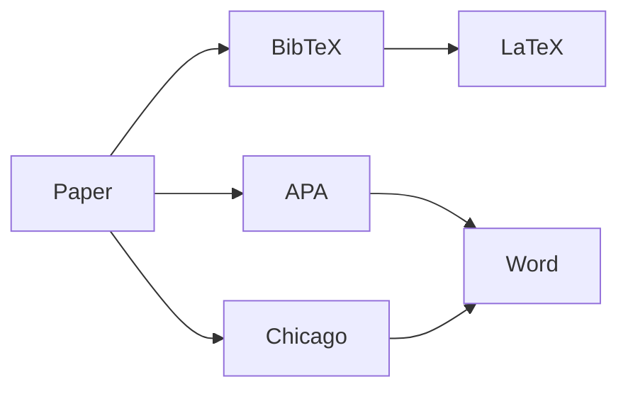

# Citation

## Purpose

This document provides citation information for Unbihexium.

## Citation Format



## Impact Factor

$$
h\text{-index} = \max\{h : \text{at least } h \text{ papers with } h \text{ citations}\}
$$

## Citation Formats

| Format | Use Case |
| ------- | ---------------- |
| BibTeX | LaTeX documents |
| APA | Academic papers |
| Chicago | Humanities |
| IEEE | Engineering |

## BibTeX

```bibtex
@software{unbihexium2025,
  author = {Unbihexium OSS Foundation},
  title = {Unbihexium: Geospatial AI Library},
  year = {2025},
  version = {1.0.0},
  url = {https://github.com/unbihexium-oss/unbihexium},
  license = {Apache-2.0}
}
```

## APA

Unbihexium OSS Foundation. (2025). Unbihexium: Geospatial AI Library (Version 1.0.0) [Computer software]. Available from <https://github.com/unbihexium-oss/unbihexium>

## CITATION.cff

Machine-readable citation in CITATION.cff file.

## DOI

DOI available via Zenodo upon stable release.
