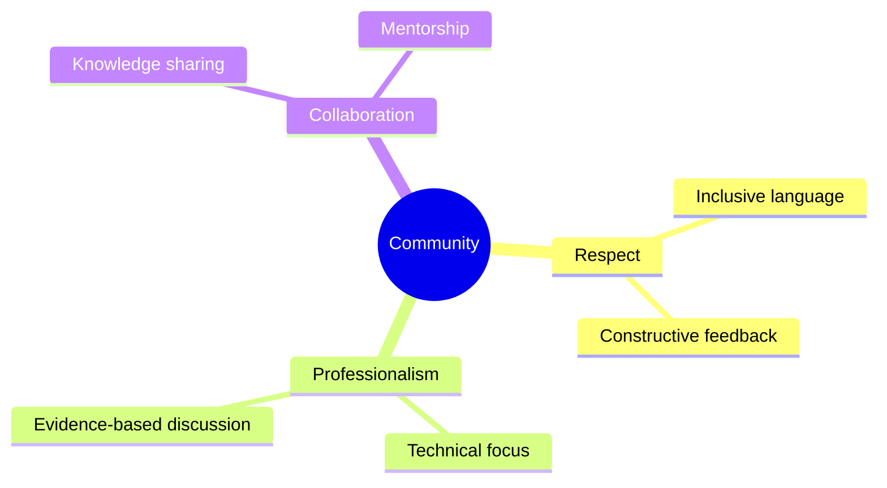

# Code of Conduct

## Purpose

This code of conduct establishes expectations for participation in the Unbihexium community.

## Scope

Applies to all project spaces including:

- GitHub repositories
- Issue trackers
- Pull requests
- Community forums

## Community Standards

## Behavior Expectations

Expected behaviors weighted by importance:

$$
\text{Community Health} = \sum_{i} w_i \cdot B_i, \quad w_i \in [0,1]
$$

| Behavior | Weight | Expected |
| ------------------------ | ------ | ----------- |
| Respectful communication | 1.0 | Required |
| Constructive feedback | 0.9 | Expected |
| Inclusive participation | 0.9 | Expected |
| Technical accuracy | 0.8 | Expected |
| Mentorship | 0.5 | Encouraged |

## Unacceptable Behavior

- Harassment or discrimination
- Personal attacks
- Trolling or inflammatory comments
- Publishing private information
- Inappropriate content

## Enforcement

1. Warning
2. Temporary ban
3. Permanent ban

## Reporting

Email: <conduct@unbihexium.dev>

Reports handled confidentially within 72 hours.

## Attribution

Adapted from the Contributor Covenant, version 2.1.
