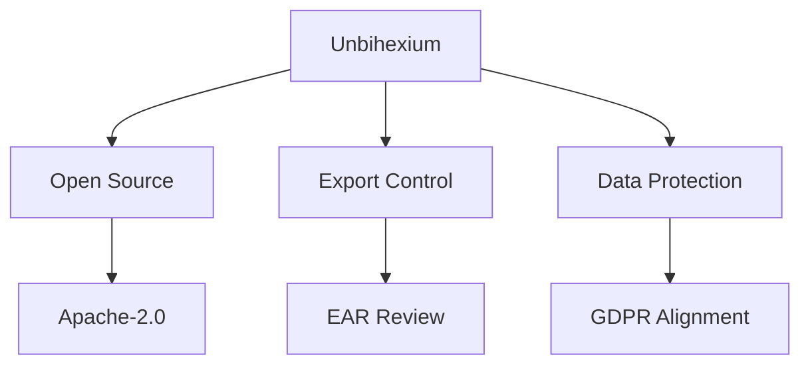

# Compliance

## Purpose

This document outlines legal and regulatory compliance for Unbihexium.

## Compliance Framework

## Compliance Score

$$
C_{\text{score}} = \frac{\text{Controls Implemented}}{\text{Controls Required}} \times 100\%
$$

## Regulatory Matrix

| Regulation | Applicability | Status |
| ------------ | --------------- | -------- |
| Apache-2.0 | License | Compliant |
| GDPR | Data privacy | Aligned |
| EAR | Export control | Under review |
| SOC 2 | Security | Not applicable |

## License Compliance

- Apache-2.0 license
- NOTICE file maintained
- Third-party licenses tracked
- SBOM generated per release

## Export Control Statement

This software may be subject to export control regulations. Users are responsible for compliance with applicable laws.

Certain capabilities (defense-related analytics) are provided as neutral frameworks only. No specific military targeting or weapons guidance is provided.

## Data Protection

- No personal data collected by default
- Local-first processing
- Opt-in telemetry only

## Audit Trail

Compliance activities documented in CHANGELOG.md.
