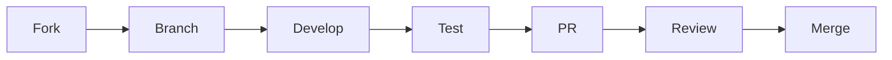

# Contributing to Unbihexium

## Purpose

This document provides guidelines for contributing to the Unbihexium project.

## Audience

- Open source contributors
- Internal developers
- Documentation writers

## Contribution Workflow

## Code Quality Metrics

Contributions must meet quality thresholds:

$$
\text{Coverage} \geq 80\%, \quad \text{Complexity} \leq 10
$$

## Contribution Types

| Type | Description | Branch Prefix |
| -------- | ----------------- | ------------- |
| Feature | New functionality | `feat/` |
| Fix | Bug correction | `fix/` |
| Docs | Documentation | `docs/` |
| Refactor | Code improvement | `refactor/` |
| Test | Test additions | `test/` |

## Getting Started

1. Fork the repository
2. Create a feature branch
3. Make changes
4. Run tests: `pytest tests/`
5. Run linting: `ruff check src/`
6. Submit pull request

## Code Standards

- Python 3.10+
- Type hints required
- Docstrings for public APIs
- No emojis in code or commits

## Commit Messages

Format: `type(scope): description`

Examples:

- `feat(models): add ship detector`
- `fix(pipeline): correct tiling logic`
- `docs(api): update reference docs`

## Review Process

All PRs require:

- Passing CI checks
- Code review approval
- Documentation updates (if applicable)

## Security

Report security issues via [SECURITY.md](SECURITY.md), not public issues.

## License

Contributions are licensed under Apache-2.0.
