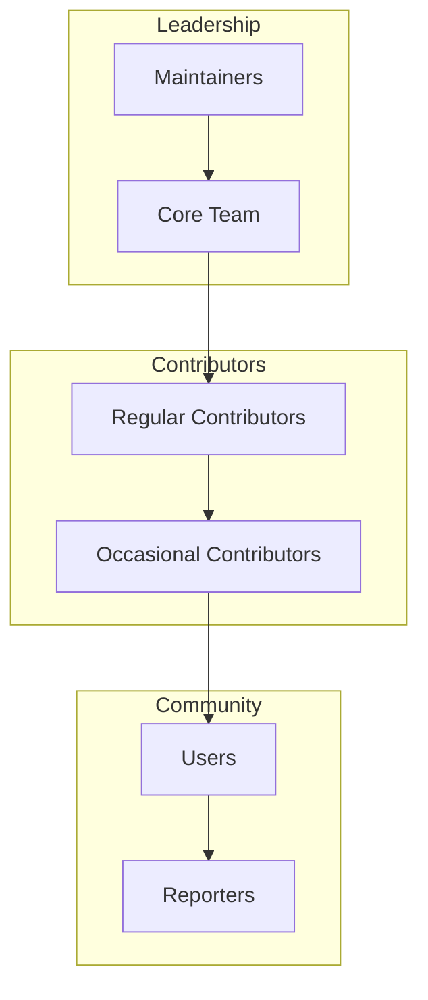

# Governance

## Purpose

This document defines the governance structure and decision-making processes for Unbihexium.

## Governance Model

## Decision Framework

Decisions weighted by impact and reversibility:

$$
\text{Decision Level} = f(\text{Impact}, \text{Reversibility})
$$

| Decision Type | Impact | Approval Required |
|---------------|--------|-------------------|
| Bug fixes | Low | 1 maintainer |
| Features | Medium | 2 maintainers |
| Breaking changes | High | Core team consensus |
| Governance | Critical | Full team vote |

## Roles

| Role | Responsibilities | Requirements |
|------|-----------------|--------------|
| Maintainer | Review, merge, release | Sustained contribution |
| Core Team | Strategy, architecture | Maintainer + experience |
| Contributor | Features, fixes | Signed CLA |

## Processes

1. **Proposals**: Via GitHub Discussions
2. **Voting**: Lazy consensus (72h silence = approval)
3. **Appeals**: Core team review

## Succession

Inactive maintainers (6 months) may be moved to emeritus status.
