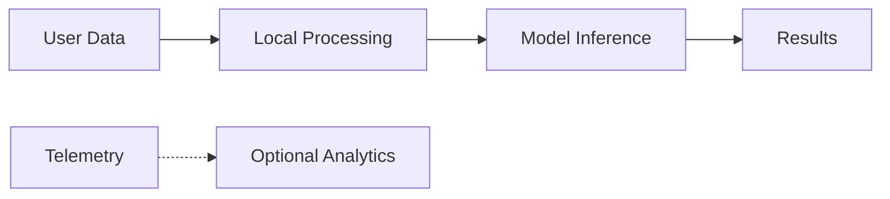

# Privacy Policy

## Purpose

This document describes data handling practices for Unbihexium.

## Scope

Covers data processed by:
- Library runtime
- CLI tools
- Model inference
- Telemetry (if enabled)

## Data Flow

## Data Categories

$$
\text{Privacy Risk} = \sum_{i} \text{Sensitivity}_i \times \text{Volume}_i
$$

| Data Type | Collected | Stored | Shared |
|-----------|-----------|--------|--------|
| Input imagery | No | No | No |
| Results | No | No | No |
| Usage stats | Opt-in | Aggregated | Anonymized |
| Error reports | Opt-in | 30 days | No |

## Principles

1. **Local-first**: Processing occurs locally
2. **Minimal collection**: Only essential data
3. **Opt-in telemetry**: Disabled by default
4. **No PII**: Personal data not collected

## User Rights

- Access collected data
- Request deletion
- Opt-out of telemetry

## Contact

Privacy inquiries: privacy@unbihexium.dev

## Updates

Policy changes announced via GitHub releases.
