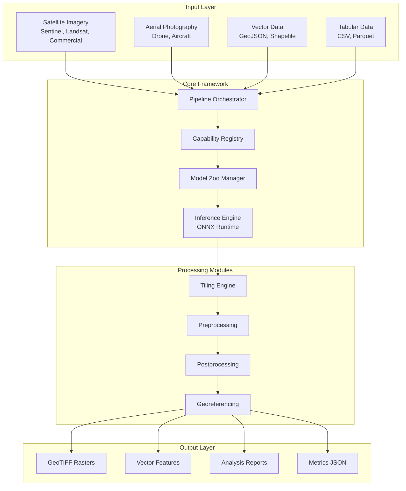
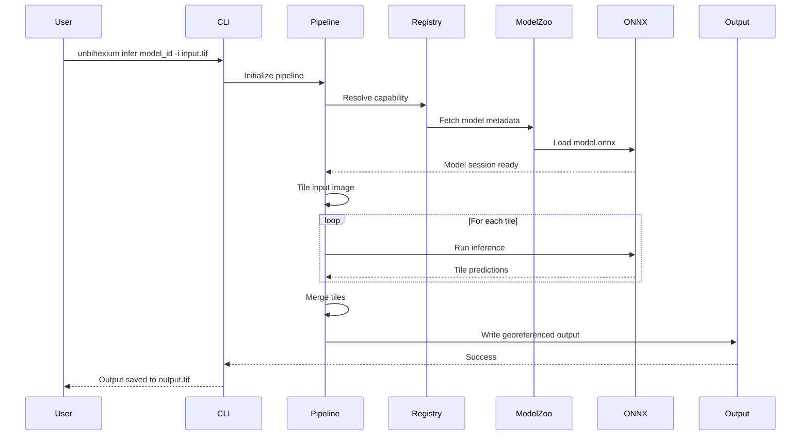
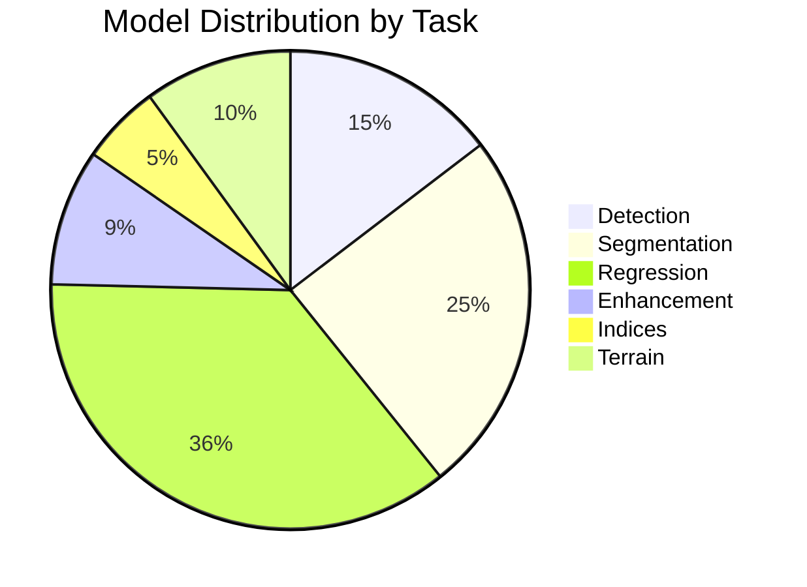

# Unbihexium

[](https://github.com/unbihexium-oss/unbihexium/actions/workflows/ci.yml)
[](https://github.com/unbihexium-oss/unbihexium/actions/workflows/release.yml)
[](https://github.com/unbihexium-oss/unbihexium/actions/workflows/codeql.yml)
[](https://github.com/unbihexium-oss/unbihexium/actions/workflows/docs.yml)
[](https://pypi.org/project/unbihexium/)
[](https://pypi.org/project/unbihexium/)
[](https://pypi.org/project/unbihexium/)
[](LICENSE.txt)
[](model_zoo/)
[](docs/capabilities/)
[](https://codecov.io/gh/unbihexium-oss/unbihexium)
[](https://github.com/astral-sh/ruff)
[](https://github.com/microsoft/pyright)
[](https://github.com/PyCQA/bandit)
[](https://cyclonedx.org/)
[](https://securityscorecards.dev/viewer/?uri=github.com/unbihexium-oss/unbihexium)
[](https://zenodo.org/)
[](CODE_OF_CONDUCT.md)
[](CONTRIBUTING.md)

---

## Executive Summary

**Unbihexium** is a production-grade, enterprise-ready Python library for geospatial artificial intelligence, Earth observation analytics, and remote sensing workflows. The library provides a unified, extensible framework encompassing 130 pre-trained models across 390 variants, 12 capability domains, and comprehensive tooling for end-to-end geospatial analysis pipelines.

---

## Table of Contents

1. [Purpose and Scope](#purpose-and-scope)
2. [System Architecture](#system-architecture)
3. [Capability Matrix](#capability-matrix)
4. [Model Zoo Overview](#model-zoo-overview)
5. [Installation](#installation)
6. [Quick Start](#quick-start)
7. [Performance Characteristics](#performance-characteristics)
8. [Documentation](#documentation)
9. [Security and Compliance](#security-and-compliance)
10. [Contributing](#contributing)
11. [Citation](#citation)
12. [License](#license)

---

## Purpose and Scope

### Intended Use Cases

| Domain | Primary Applications |
|--------|---------------------|
| Defense and Intelligence | Neutral analytics, situational awareness, maritime domain awareness |
| Agriculture | Crop monitoring, yield prediction, precision farming |
| Urban Planning | Growth assessment, infrastructure monitoring, land use analysis |
| Environmental Monitoring | Deforestation detection, flood risk assessment, pollution tracking |
| Energy Sector | Pipeline monitoring, site selection, asset management |
| Insurance | Risk assessment, damage evaluation, underwriting support |

### Non-Goals

This library is NOT designed for:
- Real-time streaming video analysis
- Mobile or edge deployment (see lightweight alternatives)
- End-user GUI applications
- Medical or clinical imaging

---

## System Architecture

### High-Level Architecture



### Component Interaction Sequence



---

## Capability Matrix

### Domain Coverage

The library implements 12 primary capability domains with 130 individual models:

| ID | Domain | Models | Capabilities | Status |
|----|--------|--------|--------------|--------|
| 01 | AI Products | 13 | Super-resolution, Detection, Segmentation, Change Detection | Production |
| 02 | Tourism and Data Processing | 10 | Route planning, Spatial analysis, Network analysis | Production |
| 03 | Vegetation Indices and Flood/Water | 12 | NDVI, NDWI, NBR, Flood risk, Water quality | Production |
| 04 | Environment and Forestry | 14 | Deforestation, Forest density, Pollution, Land degradation | Production |
| 05 | Asset Management and Energy | 12 | Pipeline monitoring, Site selection, Displacement monitoring | Production |
| 06 | Urban and Agriculture | 18 | Urban planning, Crop classification, Yield prediction | Production |
| 07 | Risk and Defense (Neutral) | 15 | Hazard analysis, Security monitoring, Maritime awareness | Production |
| 08 | Value-Added Imagery | 4 | DSM, DEM, Orthorectification, Mosaicking | Production |
| 09 | Benefits Narrative | - | Documentation only | N/A |
| 10 | Satellite Imagery Features | 6 | Stereo, Pansharpening, Multispectral processing | Production |
| 11 | Resolution and Metadata QA | 4 | Quality assurance, Metadata validation | Production |
| 12 | Radar and SAR | 8 | Amplitude, Phase, InSAR workflows | Research |

### Capability-to-Model Mapping Formula

The relationship between capabilities and models follows:

$$
\text{Coverage}(c) = \frac{|\{m \in M : c \in \text{capabilities}(m)\}|}{|M_{\text{required}}(c)|}
$$

Where:
- $c$ is a capability identifier
- $M$ is the set of all models
- $M_{\text{required}}(c)$ is the minimum model set for capability $c$

---

## Model Zoo Overview

### Model Distribution



### Variant Specifications

Each model is available in three variants optimized for different use cases:

| Variant | Input Resolution | Parameters | Memory | Throughput | Use Case |
|---------|-----------------|------------|--------|------------|----------|
| **tiny** | 32 x 32 px | ~10K | ~5 MB | 500 tiles/sec | Edge devices, rapid prototyping, CI/CD testing |
| **base** | 64 x 64 px | ~50K | ~20 MB | 100 tiles/sec | Production workloads, balanced accuracy/speed |
| **large** | 128 x 128 px | ~200K | ~80 MB | 25 tiles/sec | Maximum accuracy, research applications |

### Model Quality Metrics

Model performance is evaluated using task-specific metrics:

$$
\text{mAP} = \frac{1}{|C|} \sum_{c \in C} \text{AP}(c)
$$

$$
\text{IoU} = \frac{|A \cap B|}{|A \cup B|} = \frac{\text{TP}}{\text{TP} + \text{FP} + \text{FN}}
$$

$$
\text{PSNR} = 10 \cdot \log_{10}\left(\frac{\text{MAX}_I^2}{\text{MSE}}\right)
$$

| Task | Primary Metric | Threshold | Measurement |
|------|---------------|-----------|-------------|
| Detection | mAP@0.5 | > 0.70 | COCO evaluation |
| Segmentation | Mean IoU | > 0.65 | Per-class average |
| Super-Resolution | PSNR | > 28 dB | Peak signal-to-noise |
| Regression | R-squared | > 0.80 | Coefficient of determination |

---

## Installation

### System Requirements

| Component | Minimum | Recommended | Notes |
|-----------|---------|-------------|-------|
| Python | 3.10 | 3.12 | 3.13 supported |
| RAM | 8 GB | 16 GB | Per concurrent pipeline |
| Disk | 5 GB | 50 GB | Model cache space |
| GPU | None | CUDA 11.8+ | 10x inference speedup |
| OS | Linux, Windows, macOS | Ubuntu 22.04 LTS | Best tested |

### Installation Methods

```bash
# Standard installation
pip install unbihexium

# With GPU acceleration
pip install unbihexium[gpu]

# Full development environment
pip install unbihexium[dev,docs,test]

# Conda installation
conda install -c conda-forge unbihexium
```

### Verification

```bash
# Verify installation
unbihexium --version

# Run self-test
unbihexium self-test
```

---

## Quick Start

### CLI Usage

```bash
# List available models
unbihexium zoo list

# Download a specific model
unbihexium zoo download ship_detector_base

# Run inference
unbihexium infer ship_detector_base \
    --input satellite_image.tif \
    --output detections.tif

# Run a complete pipeline
unbihexium pipeline run detection \
    --config pipeline_config.yaml \
    --input data/ \
    --output results/
```

### Python API

```python
from unbihexium import Pipeline
from unbihexium.zoo import get_model, list_models

# Discover available models
models = list_models(task="detection")

# Load and run pipeline
pipeline = Pipeline.from_config("ship_detection")
results = pipeline.run("satellite_image.tif")

# Access predictions
for detection in results.detections:
    print(f"Class: {detection.label}, Confidence: {detection.score:.2f}")
    print(f"Bounding Box: {detection.bbox}")
```

---

## Performance Characteristics

### Throughput Analysis

Processing throughput depends on hardware configuration and model variant:

$$
T = \frac{N_{\text{tiles}} \times S_{\text{tile}}^2}{t_{\text{total}}} \quad [\text{pixels/second}]
$$



```mermaid
xychart-beta
    title "Inference Throughput by Hardware"
    x-axis [tiny, base, large]
    y-axis "Tiles per Second" 0 --> 600
    bar "CPU (8 cores)" [120, 25, 6]
    bar "GPU (RTX 3080)" [500, 100, 25]
    bar "GPU (A100)" [800, 200, 50]
```

### Memory Scaling

$$
M_{\text{total}} = M_{\text{base}} + N_{\text{batch}} \times M_{\text{tile}} + M_{\text{model}}
$$

---

## Documentation

| Section | Description | Link |
|---------|-------------|------|
| Getting Started | Installation, quickstart, configuration | [docs/getting_started/](docs/getting_started/) |
| Tutorials | Step-by-step guides | [docs/tutorials/](docs/tutorials/) |
| API Reference | Python API documentation | [docs/reference/api.md](docs/reference/api.md) |
| CLI Reference | Command-line interface | [docs/reference/cli.md](docs/reference/cli.md) |
| Architecture | System design | [docs/architecture/](docs/architecture/) |
| Capabilities | Domain encyclopedia (12 pages) | [docs/capabilities/](docs/capabilities/) |
| Model Zoo | Model catalog and usage | [docs/model_zoo/](docs/model_zoo/) |
| Security | Security practices | [docs/security/](docs/security/) |

---

## Security and Compliance

### Security Posture

| Control | Implementation | Status |
|---------|---------------|--------|
| Dependency Scanning | Dependabot, Safety | Active |
| Static Analysis | CodeQL, Bandit | Active |
| Model Integrity | SHA256 verification | Active |
| Supply Chain | SBOM generation, SLSA | Active |
| Secrets Management | GitHub Secrets, no hardcoding | Enforced |

### Compliance

- **License**: Apache-2.0 (permissive, commercial-friendly)
- **Export Control**: Reviewed for EAR compliance
- **Data Privacy**: Local-first processing, opt-in telemetry
- **Responsible Use**: Defense/intelligence capabilities are neutral analytics only

---

## Contributing

We welcome contributions from the community. Please read:

- [CONTRIBUTING.md](CONTRIBUTING.md) - Contribution guidelines
- [CODE_OF_CONDUCT.md](CODE_OF_CONDUCT.md) - Community standards
- [GOVERNANCE.md](GOVERNANCE.md) - Project governance

---

## Citation

```bibtex
@software{unbihexium2025,
  author       = {Unbihexium OSS Foundation},
  title        = {Unbihexium: Production-Grade Geospatial AI Library},
  year         = {2025},
  version      = {1.0.0},
  publisher    = {GitHub},
  url          = {https://github.com/unbihexium-oss/unbihexium},
  license      = {Apache-2.0}
}
```

---

## License

Copyright 2025 Unbihexium OSS Foundation

Licensed under the Apache License, Version 2.0. See [LICENSE.txt](LICENSE.txt) for details.

---

*Unbihexium - Element 126 - Bridging Earth Observation and Artificial Intelligence*
