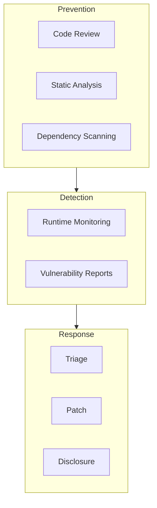

# Security Policy

## Purpose

This document defines security practices and vulnerability reporting procedures for Unbihexium.

## Scope

Covers:

- Source code vulnerabilities
- Dependency security
- Model integrity
- Supply chain security

## Security Model

## Risk Assessment

Vulnerability severity follows CVSS scoring:

$$
\text{CVSS} = \text{Base} + \text{Temporal} + \text{Environmental}
$$

| Severity | CVSS Range | Response Time |
| ---------- | ------------ | --------------- |
| Critical | 9.0-10.0 | 24 hours |
| High | 7.0-8.9 | 7 days |
| Medium | 4.0-6.9 | 30 days |
| Low | 0.1-3.9 | 90 days |

## Supported Versions

| Version | Supported |
| --------- | ----------- |
| 1.x | Yes |
| 0.x | No |

## Reporting Vulnerabilities

1. Do NOT create public issues for security vulnerabilities
2. Email: <security@unbihexium.dev>
3. Include: description, reproduction steps, impact assessment
4. Response within 48 hours

## Security Practices

- All dependencies pinned with hashes
- SBOM generated for each release
- Container images scanned
- Secrets never committed
- Model checksums verified

## Disclosure Policy

- Coordinated disclosure (90 days)
- CVE assignment for confirmed vulnerabilities
- Public advisory after patch release
