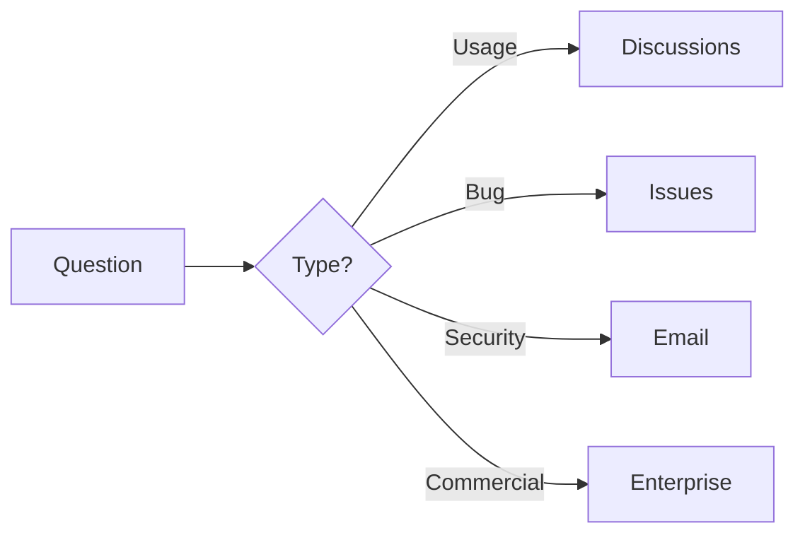

# Support

## Purpose

This document describes how to get help with Unbihexium.

## Support Channels

## Response Time Expectation

$$
T_{\text{response}} \approx \begin{cases}
24h & \text{Critical issues} \\
72h & \text{Bug reports} \\
1\text{week} & \text{Feature requests}
\end{cases}
$$

| Channel | Use Case | SLA |
| --------- | ---------- | ----- |
| GitHub Issues | Bug reports | 72h |
| GitHub Discussions | Questions | Best effort |
| Email | Security issues | 48h |
| Enterprise | Commercial support | Contractual |

## Before Asking

1. Check documentation
2. Search existing issues
3. Review FAQ
4. Prepare minimal reproduction

## Issue Templates

Use provided templates for:

- Bug reports
- Feature requests
- Documentation issues

## Commercial Support

Enterprise support available. Contact: <enterprise@unbihexium.dev>

## Community Guidelines

- Be specific
- Include versions
- Provide context
- Follow up on resolutions
