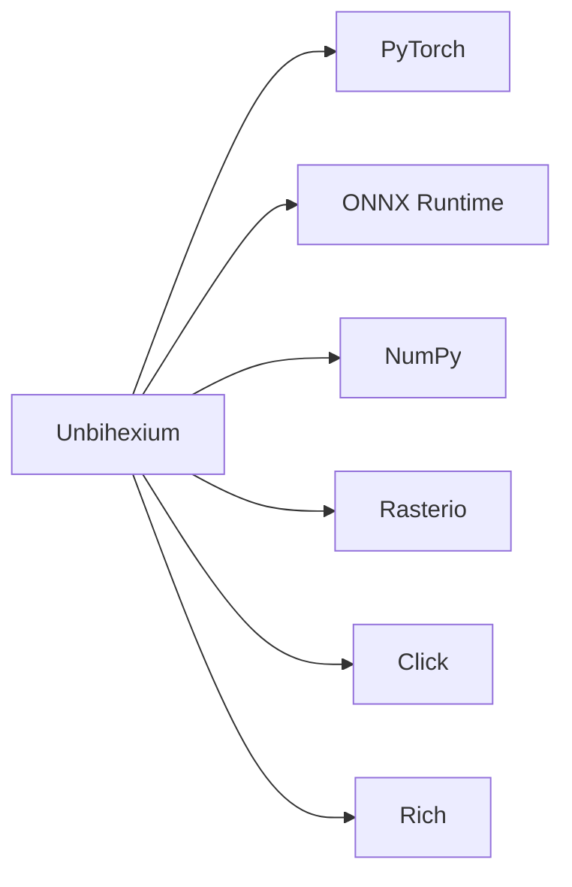

# Third-Party Notices

## Purpose

This document lists third-party software used by Unbihexium.

## Dependency Overview

## License Compatibility

$$
\text{Risk} = \sum_i \text{Copyleft}_i \times \text{LinkType}_i
$$

All dependencies use permissive licenses compatible with Apache-2.0.

## Dependency Table

| Package | Version | License | Purpose |
|---------|---------|---------|---------|
| torch | 2.0+ | BSD-3 | Model training |
| onnxruntime | 1.15+ | MIT | Inference engine |
| numpy | 1.24+ | BSD-3 | Array operations |
| rasterio | 1.3+ | BSD-3 | Geospatial I/O |
| click | 8.0+ | BSD-3 | CLI framework |
| rich | 13.0+ | MIT | Terminal formatting |
| pyyaml | 6.0+ | MIT | YAML parsing |
| shapely | 2.0+ | BSD-3 | Geometry operations |
| pyproj | 3.5+ | MIT | Projections |
| tqdm | 4.64+ | MIT | Progress bars |

## Full License Texts

Complete license texts available in `licenses/` directory.

## SBOM

Software Bill of Materials generated with each release.

See `sbom.json` in release assets.
