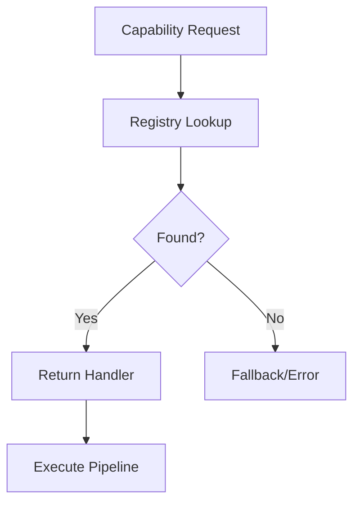

# Capability Registry

## Purpose

Central registry for capability discovery and management.

## Registry Architecture



## Registration Formula

$$
R = \{(c_i, h_i, m_i) : c_i \in C, h_i \in H, m_i \in M\}
$$

Where:

- $C$ = capability identifiers
- $H$ = handler functions
- $M$ = model mappings

## Registry Schema

| Field | Type | Description |
| ------- | ------ | ------------- |
| capability_id | string | Unique identifier |
| name | string | Human-readable name |
| handler | callable | Processing function |
| models | list | Associated model IDs |
| input_type | string | Expected input format |
| output_type | string | Result format |

## Usage

```python
from unbihexium.registry import get_capability, list_capabilities

# List all capabilities
caps = list_capabilities()

# Get specific capability
cap = get_capability("ship_detection")

# Execute
result = cap.execute(input_data)
```

## Registration

```python
from unbihexium.registry import register_capability

@register_capability(
    id="custom_detection",
    models=["custom_model_base"]
)
def custom_handler(data):
    return process(data)
```
