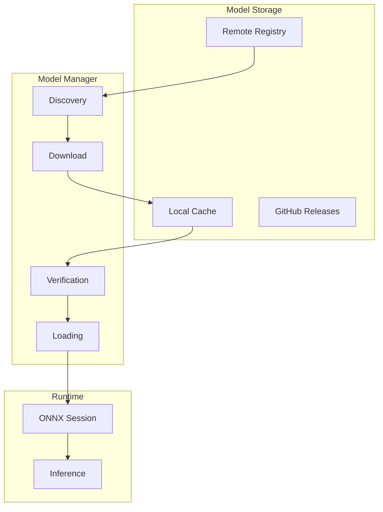
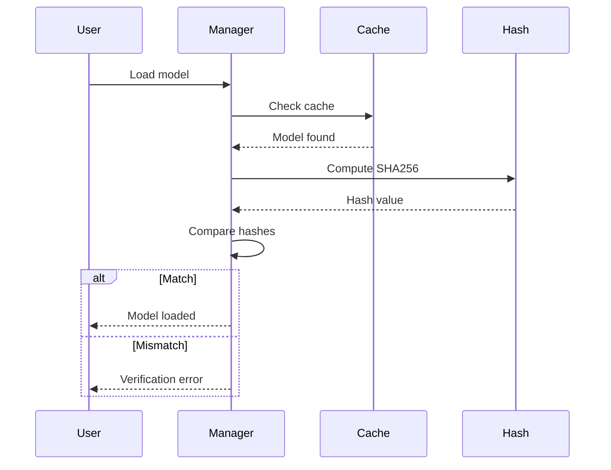

# Model Zoo Architecture

## Purpose

Design of the model zoo infrastructure for model management, versioning, and distribution.

## Architecture Overview

## Model Identification

$$
\text{ModelID} = \text{Name} + \text{Variant} + \text{Version}
$$

Example: `ship_detector_base_v1.0.0`

## Storage Structure

| Path | Contents |
| ------ | ---------- |
| `model_zoo/assets/{variant}/{id}/` | Model artifacts |
| `model_zoo/manifests/{id}.json` | Model metadata |
| `model_zoo/cards/{id}.md` | Documentation |
| `model_zoo/inventory.yaml` | Catalog |

## Model Artifacts

| File | Purpose | Required |
| ------ | --------- | ---------- |
| `model.onnx` | ONNX model weights | Yes |
| `config.json` | Input/output spec | Yes |
| `model.sha256` | Integrity hash | Yes |
| `labels.json` | Class labels | If applicable |
| `metrics.json` | Performance data | Yes |

## Verification Flow

## Version Compatibility

$$
\text{Compatible}(v_{\text{lib}}, v_{\text{model}}) = \text{Major}(v_{\text{lib}}) = \text{Major}(v_{\text{model}})
$$
