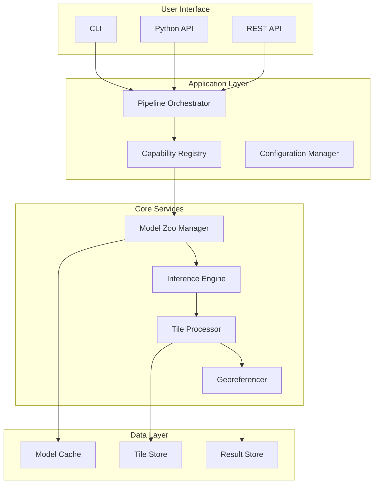
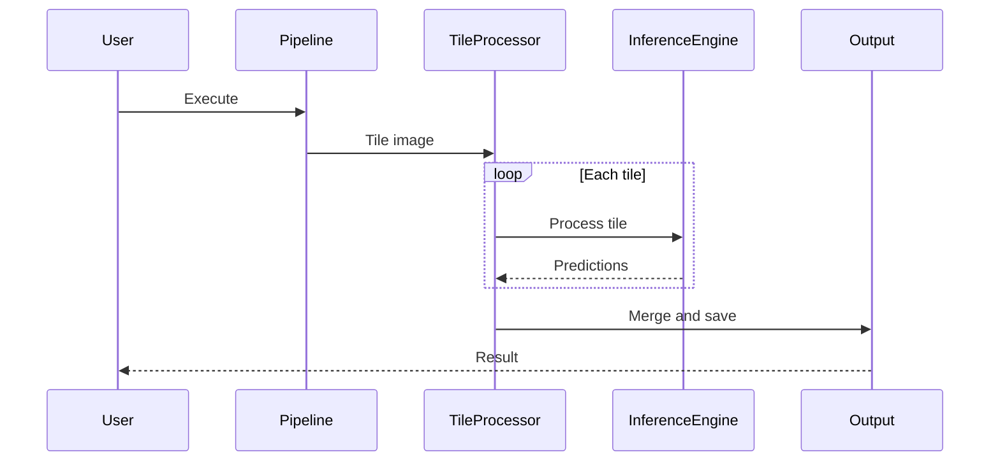

# Architecture Overview

## Purpose

System architecture documentation for Unbihexium.

## High-Level Architecture

## Component Responsibilities

$$
\text{System} = \bigcup_{i=1}^{n} \text{Component}_i \quad \text{where} \quad \bigcap_{i \neq j} \text{Component}_i \cap \text{Component}_j = \emptyset
$$

| Component | Responsibility | Dependencies |
|-----------|---------------|--------------|
| Pipeline Orchestrator | Workflow execution | Registry, Config |
| Capability Registry | Capability lookup | Model Zoo |
| Model Zoo Manager | Model lifecycle | Cache |
| Inference Engine | ONNX execution | Tile Processor |
| Tile Processor | Image tiling | Georeferencer |
| Georeferencer | CRS handling | GDAL/Rasterio |

## Data Flow

## Design Principles

1. **Modularity**: Independent components
2. **Extensibility**: Plugin architecture
3. **Consistency**: Uniform interfaces
4. **Observability**: Logging and metrics
5. **Resilience**: Error handling

## Technology Stack

| Layer | Technology |
|-------|------------|
| Language | Python 3.10+ |
| Inference | ONNX Runtime |
| Geospatial | GDAL, Rasterio, Shapely |
| CLI | Click, Rich |
| Testing | PyTest |
| Linting | Ruff, Pyright |
