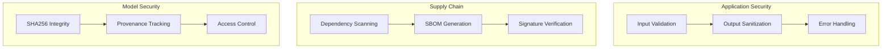

# Security Model

## Purpose

Security architecture and threat model for Unbihexium.

## Security Layers

## Threat Model

$$
\text{Risk} = P(\text{Threat}) \times \text{Impact} \times (1 - \text{Mitigation})
$$

| Threat | Likelihood | Impact | Mitigation |
| -------- | ------------ | -------- | ------------ |
| Model tampering | Medium | High | SHA256 verification |
| Dependency exploit | Medium | High | Pinned deps, scanning |
| Input injection | Low | Medium | Validation |
| Data exfiltration | Low | High | Local processing |

## Security Controls

| Control | Implementation | Status |
| --------- | --------------- | -------- |
| Input validation | pydantic models | Active |
| Dependency scanning | Dependabot, Safety | Active |
| Static analysis | CodeQL, Bandit | Active |
| Model integrity | SHA256 hashes | Active |
| Secrets management | No hardcoding | Enforced |
| SBOM | CycloneDX | Active |

## Secure Development

1. All dependencies pinned with hashes
2. Security advisories monitored
3. Quarterly dependency updates
4. Vulnerability response SLA

## Data Handling

- Local-first processing
- No cloud transmission by default
- Opt-in telemetry only
- No PII collection
