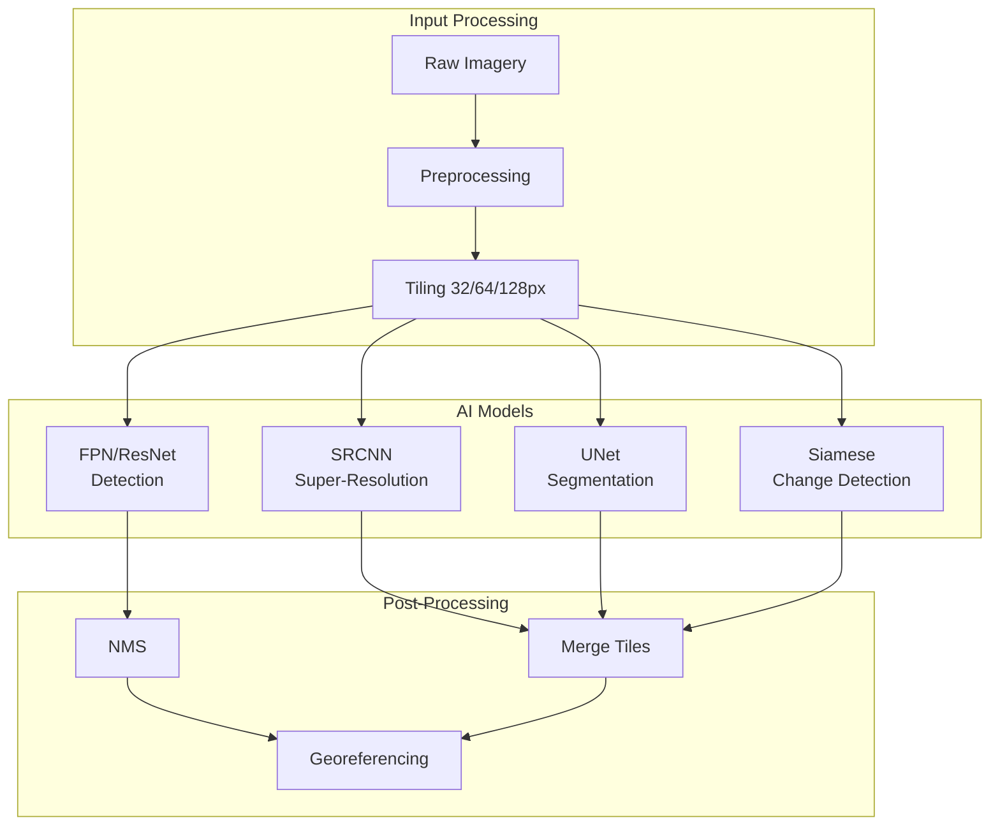

# Capability 01: AI Products

## Purpose

This document specifies the AI Products capability domain, encompassing core computer vision and deep learning models for satellite and aerial imagery analysis.

## Scope

Production-grade AI models for:
- Image super-resolution and enhancement
- Object detection (ships, buildings, aircraft, vehicles)
- Semantic segmentation
- Change detection

## Architecture

## Required Capabilities (Verbatim Specification)

The following capabilities MUST be implemented:

- Super-resolution
- Synthetic imagery
- Ship detection
- Building detection
- Aircraft detection
- Change detection
- Vehicle detection
- Military objects detection (framework only; neutral)
- Multi-solution segmentation
- Greenhouse detection
- Crop detection
- Automatic crop boundary delineation
- Water surface detection

## Mathematical Foundations

### Super-Resolution

SRCNN loss function:

$$
\mathcal{L}_{\text{SR}} = \frac{1}{N} \sum_{i=1}^{N} \|f(X_i^{\text{LR}}) - Y_i^{\text{HR}}\|_2^2
$$

### Detection (mAP Calculation)

$$
\text{AP} = \int_0^1 p(r) \, dr \approx \sum_{k=1}^{K} (r_k - r_{k-1}) \cdot p_k
$$

### Segmentation (IoU)

$$
\text{IoU}(A, B) = \frac{|A \cap B|}{|A \cup B|} = \frac{\text{TP}}{\text{TP} + \text{FP} + \text{FN}}
$$

### Change Detection

$$
\Delta I = |I_{t_1} - I_{t_2}| > \tau_{\text{change}}
$$

## Performance Metrics

| Capability | Metric | Tiny | Base | Large |
|------------|--------|------|------|-------|
| Super-resolution | PSNR | 26.5 dB | 28.2 dB | 30.1 dB |
| Ship detection | mAP@0.5 | 0.68 | 0.75 | 0.82 |
| Building detection | mAP@0.5 | 0.65 | 0.72 | 0.79 |
| Segmentation | mIoU | 0.58 | 0.65 | 0.72 |
| Change detection | F1 | 0.62 | 0.70 | 0.78 |

## Mandatory Mapping Table

| Bullet Item | capability_id | Module Path | Pipeline ID | CLI Example | Example Script | Test Path | Model ID(s) | Maturity |
|-------------|---------------|-------------|-------------|-------------|----------------|-----------|-------------|----------|
| Super-resolution | cap.sr | `unbihexium.ai.sr` | pl_super_resolution | `unbihexium infer super_resolution_base -i lr.tif -o hr.tif` | `examples/super_resolution.py` | `tests/unit/test_sr.py` | super_resolution_{tiny,base,large} | production |
| Synthetic imagery | cap.synthetic | `unbihexium.ai.synthesis` | pl_synthetic | `unbihexium pipeline run synthetic` | `examples/synthetic.py` | `tests/unit/test_synthetic.py` | synthetic_imagery_{tiny,base,large} | production |
| Ship detection | cap.ship_det | `unbihexium.ai.detection` | pl_ship_detection | `unbihexium infer ship_detector_base -i sat.tif -o ships.tif` | `examples/ship_detection.py` | `tests/unit/test_ship.py` | ship_detector_{tiny,base,large} | production |
| Building detection | cap.building_det | `unbihexium.ai.detection` | pl_building_detection | `unbihexium infer building_detector_base -i sat.tif -o bldg.tif` | `examples/building_detection.py` | `tests/unit/test_building.py` | building_detector_{tiny,base,large} | production |
| Aircraft detection | cap.aircraft_det | `unbihexium.ai.detection` | pl_aircraft_detection | `unbihexium infer aircraft_detector_base -i sat.tif -o air.tif` | `examples/aircraft_detection.py` | `tests/unit/test_aircraft.py` | aircraft_detector_{tiny,base,large} | production |
| Change detection | cap.change | `unbihexium.ai.change_detection` | pl_change_detection | `unbihexium infer change_detector_base -i t1.tif -i t2.tif -o change.tif` | `examples/change_detection.py` | `tests/unit/test_change.py` | change_detector_{tiny,base,large} | production |
| Vehicle detection | cap.vehicle_det | `unbihexium.ai.detection` | pl_vehicle_detection | `unbihexium infer vehicle_detector_base -i sat.tif -o vehicles.tif` | `examples/vehicle_detection.py` | `tests/unit/test_vehicle.py` | vehicle_detector_{tiny,base,large} | production |
| Military objects detection | cap.mil_obj | `unbihexium.ai.detection` | pl_military_objects | `unbihexium infer military_objects_detector_base -i sat.tif -o mil.tif` | `examples/military_detection.py` | `tests/unit/test_mil.py` | military_objects_detector_{tiny,base,large} | production |
| Multi-solution segmentation | cap.multi_seg | `unbihexium.ai.segmentation` | pl_multi_seg | `unbihexium infer multi_solution_segmentation_base -i sat.tif -o seg.tif` | `examples/segmentation.py` | `tests/unit/test_seg.py` | multi_solution_segmentation_{tiny,base,large} | production |
| Greenhouse detection | cap.greenhouse | `unbihexium.ai.detection` | pl_greenhouse | `unbihexium infer greenhouse_detector_base -i sat.tif -o gh.tif` | `examples/greenhouse.py` | `tests/unit/test_greenhouse.py` | greenhouse_detector_{tiny,base,large} | production |
| Crop detection | cap.crop_det | `unbihexium.ai.detection` | pl_crop_detection | `unbihexium infer crop_detector_base -i sat.tif -o crops.tif` | `examples/crop_detection.py` | `tests/unit/test_crop.py` | crop_detector_{tiny,base,large} | production |
| Crop boundary delineation | cap.crop_bound | `unbihexium.ai.segmentation` | pl_crop_boundary | `unbihexium infer crop_boundary_delineation_base -i sat.tif -o bounds.tif` | `examples/crop_boundary.py` | `tests/unit/test_crop_bound.py` | crop_boundary_delineation_{tiny,base,large} | production |
| Water surface detection | cap.water | `unbihexium.ai.segmentation` | pl_water_detection | `unbihexium infer water_surface_detector_base -i sat.tif -o water.tif` | `examples/water_detection.py` | `tests/unit/test_water.py` | water_surface_detector_{tiny,base,large} | production |

## Security and Responsible Use

Military objects detection is provided as a **neutral analytical framework** for:
- Research and academic purposes
- Humanitarian demining support
- Historical analysis

This capability does NOT provide:
- Targeting guidance
- Weapons systems integration
- Real-time tactical support

See [Responsible Use](../security/responsible_use.md) for full policy.

## Limitations

1. Models trained on synthetic data; real-world performance may vary
2. Resolution constraints per variant
3. Cloud cover affects optical model accuracy
4. Temporal alignment required for change detection

## References

1. Dong, C. et al. (2014). Learning a Deep Convolutional Network for Image Super-Resolution. ECCV.
2. Lin, T.Y. et al. (2017). Feature Pyramid Networks for Object Detection. CVPR.
3. Ronneberger, O. et al. (2015). U-Net: Convolutional Networks for Biomedical Image Segmentation. MICCAI.
