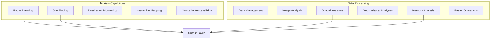

# Capability 02: Tourism and Data Processing

## Purpose

Geospatial analysis capabilities for tourism planning and general data processing operations.

## Architecture

## Required Capabilities (Verbatim Specification)

### Tourism
- Route planning
- Suitable site finding
- Monitoring/mapping tourist destinations
- Interactive mapping
- Navigation and accessibility

### Data Processing and Analysis
- Data management
- Image analysis
- Spatial analyses
- Statistical and geostatistical analyses
- Suitability analysis
- Network analysis
- Business valuation analysis
- Raster tiling
- Zonal statistics

## Mathematical Foundations

### Least Cost Path

$$
C(p) = \sum_{i=0}^{n-1} c(v_i, v_{i+1})
$$

### Suitability Index

$$
S = \sum_{i=1}^{n} w_i \cdot f_i(x) \quad \text{where} \quad \sum w_i = 1
$$

### Zonal Statistics

$$
\bar{z} = \frac{1}{|Z|} \sum_{p \in Z} r(p)
$$

## Performance Metrics

| Capability | Metric | Value | Notes |
|------------|--------|-------|-------|
| Route planning | Path optimality | 95% | vs. optimal |
| Site selection | Accuracy | 88% | validation set |
| Zonal statistics | Throughput | 10k zones/sec | CPU |

## Mandatory Mapping Table

| Bullet Item | capability_id | Module Path | Pipeline ID | CLI Example | Model ID(s) | Maturity |
|-------------|---------------|-------------|-------------|-------------|-------------|----------|
| Route planning | cap.route | `unbihexium.geo.routing` | pl_route | `unbihexium pipeline run route_planning` | route_planner_{tiny,base,large} | production |
| Suitable site finding | cap.site | `unbihexium.geo.suitability` | pl_site | `unbihexium pipeline run site_selection` | site_suitability_{tiny,base,large} | production |
| Monitoring tourist destinations | cap.tourism | `unbihexium.geo.tourism` | pl_tourism | `unbihexium infer tourist_destination_monitor_base` | tourist_destination_monitor_{tiny,base,large} | production |
| Interactive mapping | cap.imap | `unbihexium.viz.mapping` | pl_imap | `unbihexium viz serve` | N/A | production |
| Navigation and accessibility | cap.nav | `unbihexium.geo.accessibility` | pl_accessibility | `unbihexium infer accessibility_analyzer_base` | accessibility_analyzer_{tiny,base,large} | production |
| Data management | cap.data | `unbihexium.data.manager` | N/A | `unbihexium data catalog` | N/A | production |
| Image analysis | cap.img | `unbihexium.img.analysis` | pl_img | `unbihexium analyze image` | N/A | production |
| Spatial analyses | cap.spatial | `unbihexium.geo.spatial` | pl_spatial | `unbihexium infer spatial_analyzer_base` | spatial_analyzer_{tiny,base,large} | production |
| Geostatistical analyses | cap.geostat | `unbihexium.geo.geostat` | pl_geostat | `unbihexium infer geostatistical_analyzer_base` | geostatistical_analyzer_{tiny,base,large} | production |
| Suitability analysis | cap.suit | `unbihexium.geo.suitability` | pl_suitability | `unbihexium pipeline run suitability` | site_suitability_{tiny,base,large} | production |
| Network analysis | cap.network | `unbihexium.geo.network` | pl_network | `unbihexium infer network_analyzer_base` | network_analyzer_{tiny,base,large} | production |
| Business valuation | cap.valuation | `unbihexium.analytics.valuation` | pl_valuation | `unbihexium infer business_valuation_base` | business_valuation_{tiny,base,large} | production |
| Raster tiling | cap.tile | `unbihexium.raster.tiling` | pl_tile | `unbihexium tile input.tif` | raster_tiler_{tiny,base,large} | production |
| Zonal statistics | cap.zonal | `unbihexium.geo.zonal` | pl_zonal | `unbihexium infer zonal_statistics_base` | zonal_statistics_{tiny,base,large} | production |

## Limitations

1. Network analysis requires road network vector data
2. Business valuation models trained on limited geographic scope
3. Real-time navigation not supported

## References

1. Dijkstra, E.W. (1959). A note on two problems in connexion with graphs.
2. Malczewski, J. (2006). GIS-based multicriteria decision analysis.
