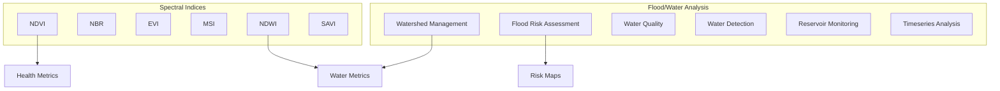

# Capability 03: Vegetation Indices and Flood/Water

## Purpose

Spectral vegetation indices calculation and flood/water body analysis capabilities.

## Architecture

## Required Capabilities (Verbatim Specification)

### Vegetation and Environmental Indices
- NDVI
- NBR
- EVI
- MSI
- NDWI
- SAVI

### Flood and Water
- River/watershed management
- Flood risk assessment
- Water quality assessment
- Water surface detection
- Reservoir/water bodies monitoring
- Timeseries mapping and analysis

## Mathematical Foundations

### Normalized Difference Vegetation Index (NDVI)

$$
\text{NDVI} = \frac{\rho_{\text{NIR}} - \rho_{\text{Red}}}{\rho_{\text{NIR}} + \rho_{\text{Red}}}
$$

### Normalized Burn Ratio (NBR)

$$
\text{NBR} = \frac{\rho_{\text{NIR}} - \rho_{\text{SWIR}}}{\rho_{\text{NIR}} + \rho_{\text{SWIR}}}
$$

### Enhanced Vegetation Index (EVI)

$$
\text{EVI} = G \cdot \frac{\rho_{\text{NIR}} - \rho_{\text{Red}}}{\rho_{\text{NIR}} + C_1 \cdot \rho_{\text{Red}} - C_2 \cdot \rho_{\text{Blue}} + L}
$$

Where $G = 2.5$, $C_1 = 6$, $C_2 = 7.5$, $L = 1$.

### Normalized Difference Water Index (NDWI)

$$
\text{NDWI} = \frac{\rho_{\text{Green}} - \rho_{\text{NIR}}}{\rho_{\text{Green}} + \rho_{\text{NIR}}}
$$

### Soil-Adjusted Vegetation Index (SAVI)

$$
\text{SAVI} = \frac{(\rho_{\text{NIR}} - \rho_{\text{Red}}) \cdot (1 + L)}{\rho_{\text{NIR}} + \rho_{\text{Red}} + L}
$$

### Flood Risk Assessment

$$
R_{\text{flood}} = P_{\text{hazard}} \times V_{\text{exposure}} \times C_{\text{vulnerability}}
$$

## Index Ranges

| Index | Min | Max | Water | Vegetation | Bare Soil |
|-------|-----|-----|-------|------------|-----------|
| NDVI | -1.0 | 1.0 | < -0.2 | > 0.3 | -0.1 to 0.2 |
| NDWI | -1.0 | 1.0 | > 0.3 | < 0 | -0.3 to 0 |
| NBR | -1.0 | 1.0 | < 0 | > 0.3 | 0 to 0.2 |
| EVI | -1.0 | 1.0 | < 0 | 0.2 to 0.8 | < 0.2 |
| SAVI | -1.0 | 1.0 | < 0 | > 0.3 | -0.1 to 0.2 |

## Mandatory Mapping Table

| Bullet Item | capability_id | Module Path | Pipeline ID | CLI Example | Model ID(s) | Maturity |
|-------------|---------------|-------------|-------------|-------------|-------------|----------|
| NDVI | cap.ndvi | `unbihexium.indices.vegetation` | pl_ndvi | `unbihexium infer ndvi_calculator_base` | ndvi_calculator_{tiny,base,large} | production |
| NBR | cap.nbr | `unbihexium.indices.fire` | pl_nbr | `unbihexium infer nbr_calculator_base` | nbr_calculator_{tiny,base,large} | production |
| EVI | cap.evi | `unbihexium.indices.vegetation` | pl_evi | `unbihexium infer evi_calculator_base` | evi_calculator_{tiny,base,large} | production |
| MSI | cap.msi | `unbihexium.indices.moisture` | pl_msi | `unbihexium infer msi_calculator_base` | msi_calculator_{tiny,base,large} | production |
| NDWI | cap.ndwi | `unbihexium.indices.water` | pl_ndwi | `unbihexium infer ndwi_calculator_base` | ndwi_calculator_{tiny,base,large} | production |
| SAVI | cap.savi | `unbihexium.indices.vegetation` | pl_savi | `unbihexium infer savi_calculator_base` | savi_calculator_{tiny,base,large} | production |
| Watershed management | cap.watershed | `unbihexium.hydro.watershed` | pl_watershed | `unbihexium infer watershed_manager_base` | watershed_manager_{tiny,base,large} | production |
| Flood risk assessment | cap.flood | `unbihexium.risk.flood` | pl_flood_risk | `unbihexium infer flood_risk_assessor_base` | flood_risk_assessor_{tiny,base,large} | production |
| Water quality | cap.water_qual | `unbihexium.hydro.quality` | pl_water_quality | `unbihexium infer water_quality_assessor_base` | water_quality_assessor_{tiny,base,large} | production |
| Water detection | cap.water_det | `unbihexium.ai.segmentation` | pl_water | `unbihexium infer water_surface_detector_base` | water_surface_detector_{tiny,base,large} | production |
| Reservoir monitoring | cap.reservoir | `unbihexium.hydro.reservoir` | pl_reservoir | `unbihexium infer reservoir_monitor_base` | reservoir_monitor_{tiny,base,large} | production |
| Timeseries analysis | cap.timeseries | `unbihexium.analytics.timeseries` | pl_ts | `unbihexium infer timeseries_analyzer_base` | timeseries_analyzer_{tiny,base,large} | production |

## References

1. Rouse, J.W. et al. (1974). Monitoring vegetation systems in the Great Plains with ERTS.
2. McFeeters, S.K. (1996). The use of the Normalized Difference Water Index (NDWI).
