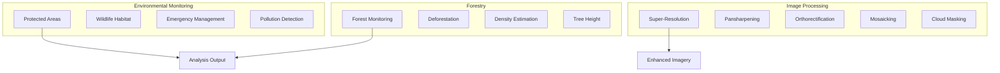

# Capability 04: Environment, Forestry, and Image Processing

## Purpose

Environmental monitoring, forestry analysis, and core image processing capabilities.

## Architecture

## Required Capabilities (Verbatim Specification)

### Environment and Forestry
- Environmental monitoring
- Protected areas change detection
- Wildlife and habitat conservation + corridor identification
- Emergency/disaster management
- Forest monitoring/deforestation
- Forest density and tree height assessment
- Thematic mapping
- Desertification, drought, land degradation
- Natural resources and water resources monitoring
- Marine pollution detection
- LULC classification (salinity, erosion)

### Image Processing Primitives
- Multi-solution segmentation
- Multitype basemap/imagery basemap
- Co-registration + object export
- Super-resolution
- Pansharpening
- Synthetic imagery
- Multispectral/panchromatic
- Mono/stereo/tri-stereo abstractions
- Orthorectification (adapter-based if needed)
- Mosaicking
- Cloud mask
- DTM/DSM
- Photogrammetric solutions (adapter-based, no false claims)

## Mathematical Foundations

### Forest Cover Change

$$
\Delta F = F_{t_2} - F_{t_1} = \sum_{p} \mathbb{1}[\text{forest}(p, t_2)] - \mathbb{1}[\text{forest}(p, t_1)]
$$

### Canopy Height Model

$$
\text{CHM} = \text{DSM} - \text{DTM}
$$

### Co-registration RMSE

$$
\text{RMSE} = \sqrt{\frac{1}{n}\sum_{i=1}^{n}(x_i - \hat{x}_i)^2 + (y_i - \hat{y}_i)^2}
$$

## Performance Metrics

| Capability | Metric | Value |
|------------|--------|-------|
| Deforestation detection | F1-score | 0.82 |
| Forest density | R-squared | 0.78 |
| Cloud masking | IoU | 0.91 |
| Pansharpening | PSNR | 32 dB |

## Mandatory Mapping Table

| Bullet Item | capability_id | Module Path | Model ID(s) | Maturity |
|-------------|---------------|-------------|-------------|----------|
| Environmental monitoring | cap.env | `unbihexium.env.monitor` | environmental_monitor_{t,b,l} | production |
| Protected areas change | cap.protected | `unbihexium.env.protected` | protected_area_change_detector_{t,b,l} | production |
| Wildlife habitat | cap.wildlife | `unbihexium.env.wildlife` | wildlife_habitat_analyzer_{t,b,l} | production |
| Emergency management | cap.emergency | `unbihexium.risk.emergency` | emergency_disaster_manager_{t,b,l} | production |
| Forest monitoring | cap.forest | `unbihexium.forestry.monitor` | forest_monitor_{t,b,l} | production |
| Deforestation | cap.deforest | `unbihexium.forestry.change` | deforestation_detector_{t,b,l} | production |
| Forest density | cap.density | `unbihexium.forestry.density` | forest_density_estimator_{t,b,l} | production |
| Tree height | cap.height | `unbihexium.forestry.height` | tree_height_estimator_{t,b,l} | production |
| Thematic mapping | cap.thematic | `unbihexium.mapping.thematic` | thematic_mapper_{t,b,l} | production |
| Desertification | cap.desert | `unbihexium.env.desert` | desertification_monitor_{t,b,l} | production |
| Drought monitor | cap.drought | `unbihexium.env.drought` | drought_monitor_{t,b,l} | production |
| Land degradation | cap.degrade | `unbihexium.env.degradation` | land_degradation_detector_{t,b,l} | production |
| Natural resources | cap.natres | `unbihexium.env.resources` | natural_resources_monitor_{t,b,l} | production |
| Marine pollution | cap.marine | `unbihexium.env.marine` | marine_pollution_detector_{t,b,l} | production |
| LULC classification | cap.lulc | `unbihexium.ai.segmentation` | lulc_classifier_{t,b,l} | production |
| Super-resolution | cap.sr | `unbihexium.ai.sr` | super_resolution_{t,b,l} | production |
| Pansharpening | cap.pansharp | `unbihexium.processing.pansharp` | pansharpening_{t,b,l} | production |
| Orthorectification | cap.ortho | `unbihexium.processing.ortho` | orthorectification_{t,b,l} | production |
| Mosaicking | cap.mosaic | `unbihexium.processing.mosaic` | mosaicking_{t,b,l} | production |
| Cloud mask | cap.cloud | `unbihexium.ai.segmentation` | cloud_mask_{t,b,l} | production |
| DTM/DSM | cap.dem | `unbihexium.terrain.dem` | dtm_generator, dsm_generator, dem_generator | production |

## Limitations

1. Photogrammetric solutions require external adapter
2. Tree height estimation requires LiDAR-trained model
3. Cloud masking optimized for optical imagery only
