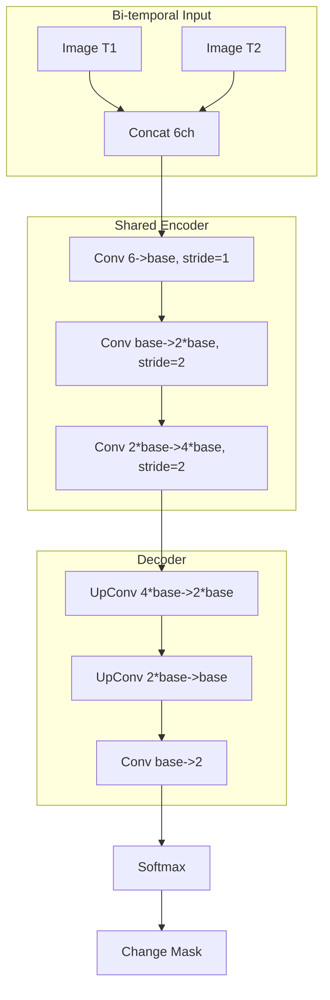

# Capability 04: Environment and Forestry

## Executive Summary

This document provides comprehensive documentation for the Environment and Forestry capability domain within the Unbihexium framework. This domain encompasses environmental monitoring, forestry analysis, ecosystem assessment, and land degradation detection models essential for conservation, carbon accounting, and sustainable land management.

The domain comprises 14 base model architectures with 56 total variants, serving applications in deforestation monitoring, forest health assessment, biodiversity conservation, and environmental impact analysis.

---

## Domain Overview

### Scope and Objectives

1. **Deforestation Detection**: Monitor forest cover loss using bi-temporal change detection with Siamese networks
2. **Forest Health Assessment**: Evaluate forest density, canopy cover, and vegetation stress
3. **Land Degradation Monitoring**: Detect erosion, desertification, and soil degradation
4. **Ecosystem Services**: Support carbon stock estimation, biodiversity assessment, and habitat mapping
5. **Protected Area Monitoring**: Track changes within conservation zones and protected areas

### Domain Statistics

| Metric | Value |
|--------|-------|
| Base Model Architectures | 14 |
| Total Model Variants | 56 |
| Minimum Parameters (tiny) | 67,329 |
| Maximum Parameters (mega) | 4,107,010 |
| Primary Tasks | Segmentation, Regression, Terrain |
| Production Status | Fully Production Ready |

---

## Model Inventory

### Complete Model Listing

| Model ID | Task | Architecture | Output | Variants | Parameter Range |
|----------|------|--------------|--------|----------|-----------------|
| deforestation_detector | Segmentation | Siamese | 2 classes | 4 | 258,754 - 4,107,010 |
| desertification_monitor | Segmentation | UNet | 2 classes | 4 | 143,394 - 2,268,802 |
| erosion_detector | Segmentation | UNet | 2 classes | 4 | 143,394 - 2,268,802 |
| forest_monitor | Segmentation | UNet | 2 classes | 4 | 143,394 - 2,268,802 |
| land_degradation_detector | Segmentation | UNet | 2 classes | 4 | 143,394 - 2,268,802 |
| forest_density_estimator | Regression | MLP | continuous | 4 | 67,329 - 1,055,745 |
| drought_monitor | Regression | MLP | continuous | 4 | 68,225 - 1,059,329 |
| natural_resources_monitor | Regression | MLP | continuous | 4 | 68,481 - 1,060,353 |
| wildlife_habitat_analyzer | Regression | MLP | continuous | 4 | 68,737 - 1,061,377 |
| watershed_manager | Regression | MLP | continuous | 4 | 68,225 - 1,059,329 |
| environmental_monitor | Regression | MLP | continuous | 4 | 69,121 - 1,062,913 |
| environmental_risk | Regression | MLP | continuous | 4 | 68,481 - 1,060,353 |
| protected_area_change_detector | Segmentation | Siamese | 2 classes | 4 | 258,754 - 4,107,010 |
| tree_height_estimator | Terrain | CNN | continuous | 4 | 186,177 - 2,956,545 |

---

## Performance Metrics

### Segmentation Performance

| Model | Metric | Tiny | Base | Large | Mega | Dataset |
|-------|--------|------|------|-------|------|---------|
| deforestation_detector | F1 | 0.72 | 0.81 | 0.88 | 0.93 | Global Forest Watch |
| deforestation_detector | IoU | 0.65 | 0.74 | 0.82 | 0.88 | Global Forest Watch |
| forest_monitor | IoU | 0.70 | 0.78 | 0.85 | 0.91 | Hansen-GFC |
| erosion_detector | IoU | 0.68 | 0.76 | 0.83 | 0.89 | Erosion-Maps |
| protected_area_change_detector | F1 | 0.70 | 0.79 | 0.86 | 0.91 | WDPA |

### Regression Performance

| Model | Metric | Tiny | Base | Large | Mega | Dataset |
|-------|--------|------|------|-------|------|---------|
| forest_density_estimator | R-squared | 0.75 | 0.82 | 0.88 | 0.93 | GEDI-L4A |
| tree_height_estimator | RMSE | 2.5m | 1.8m | 1.2m | 0.8m | GEDI-L2A |
| drought_monitor | R-squared | 0.70 | 0.78 | 0.84 | 0.89 | SPEI-Global |

---

## Carbon Stock Estimation

### Allometric Equations

Above Ground Biomass (AGB) estimation using allometric models:

$$
\text{AGB} = a \times D^{b_1} \times H^{b_2} \times \rho^{b_3}
$$

Where:
- $D$ = Diameter at Breast Height (cm)
- $H$ = Tree height (m)
- $\rho$ = Wood density (g/cm^3)
- $a, b_1, b_2, b_3$ = Species-specific coefficients

### Pan-tropical Model (Chave et al., 2014)

$$
\text{AGB} = 0.0673 \times (\rho D^2 H)^{0.976}
$$

### Carbon Content

$$
C = \text{AGB} \times 0.47
$$

### CO2 Equivalent

$$
\text{CO}_2\text{e} = C \times \frac{44}{12} = C \times 3.67
$$

### Carbon Flux from Deforestation

$$
E_{deforestation} = A_{loss} \times C_{stock} \times CF_{emission}
$$

Where:
- $A_{loss}$ = Area of forest loss (ha)
- $C_{stock}$ = Carbon stock per hectare (tC/ha)
- $CF_{emission}$ = Committed emission factor (typically 0.9)

---

## Forest Metrics

### Canopy Cover

$$
CC = \frac{A_{canopy}}{A_{total}} \times 100\%
$$

### Leaf Area Index (LAI)

$$
\text{LAI} = -\frac{\ln(P_0/P)}{k}
$$

Where:
- $P_0$ = Above-canopy radiation
- $P$ = Below-canopy radiation
- $k$ = Extinction coefficient

### Forest Fragmentation Index

$$
F = \frac{P_{edge}}{A_{forest}}
$$

Where $P_{edge}$ is edge perimeter and $A_{forest}$ is forest area.

### Shannon Diversity Index

$$
H' = -\sum_{i=1}^{S} p_i \ln(p_i)
$$

Where $p_i$ is the proportion of species $i$ and $S$ is total species count.

---

## Change Detection Methodology

### Siamese Network Architecture



### Change Detection Formula

$$
\Delta = |f_{encoder}(I_{t_1}) - f_{encoder}(I_{t_2})|
$$

### Temporal Analysis

Multi-temporal change vector analysis:

$$
\text{CVA} = \sqrt{\sum_{b=1}^{n}(X_{b,t_2} - X_{b,t_1})^2}
$$

Where $X_{b,t}$ is the reflectance in band $b$ at time $t$.

---

## Usage Examples

### CLI Usage

```bash
# Deforestation detection
unbihexium infer deforestation_detector_mega \
    --input-t1 forest_2020.tif \
    --input-t2 forest_2024.tif \
    --output deforestation_map.tif \
    --threshold 0.5

# Forest density estimation
unbihexium infer forest_density_estimator_large \
    --input features.csv \
    --output density.csv

# Tree height estimation
unbihexium infer tree_height_estimator_mega \
    --input stereo_pair.tif \
    --output canopy_height.tif \
    --output-format COG

# Protected area monitoring
unbihexium infer protected_area_change_detector_mega \
    --input-t1 protected_2020.tif \
    --input-t2 protected_2024.tif \
    --output changes.geojson \
    --boundary protected_boundary.geojson
```

### Python API Usage

```python
from unbihexium import Pipeline, Config
from unbihexium.zoo import get_model
import rasterio
import numpy as np

# Deforestation Detection
deforestation_model = get_model("deforestation_detector_mega")

config = Config(
    tile_size=256,
    overlap=32,
    batch_size=8,
    device="cuda:0",
    threshold=0.5
)

deforestation_pipeline = Pipeline.from_config(
    capability="deforestation_detection",
    variant="mega",
    config=config
)

change_map = deforestation_pipeline.run(
    t1="forest_2020.tif",
    t2="forest_2024.tif"
)

change_map.save("deforestation.tif")

# Calculate statistics
stats = change_map.statistics()
print(f"Deforestation area: {stats['change_area_km2']:.2f} km^2")
print(f"Deforestation rate: {stats['annual_rate']:.2f}%/year")
print(f"Carbon loss estimate: {stats['carbon_loss_tc']:.0f} tC")

# Forest Density Estimation
density_model = get_model("forest_density_estimator_mega")

# Prepare features
import pandas as pd

features = pd.DataFrame({
    'ndvi_mean': ndvi_values,
    'ndvi_std': ndvi_std,
    'height_mean': height_values,
    'height_std': height_std,
    'slope': slope_values,
    'aspect': aspect_values,
    'twi': twi_values,
    'precipitation': precip_values
})

density = density_model.predict(features)
print(f"Mean forest density: {density.mean():.2f} stems/ha")

# Tree Height Estimation from Stereo
height_model = get_model("tree_height_estimator_mega")

height_config = Config(
    tile_size=512,
    overlap=64,
    batch_size=4,
    device="cuda:0"
)

height_pipeline = Pipeline.from_config(
    capability="canopy_height",
    variant="mega",
    config=height_config
)

chm = height_pipeline.run("stereo_imagery.tif")
chm.save("canopy_height_model.tif")

# Calculate biomass
with rasterio.open("canopy_height_model.tif") as src:
    heights = src.read(1)
    
# Apply allometric equation (simplified)
agb = 0.0673 * (0.5 * 20**2 * heights)**0.976  # Assuming D=20cm, rho=0.5
carbon = agb * 0.47
co2e = carbon * 3.67

print(f"Mean canopy height: {np.nanmean(heights):.1f} m")
print(f"Mean AGB: {np.nanmean(agb):.1f} kg")
print(f"Total carbon stock: {np.nansum(carbon)/1e6:.2f} MtC")
```

---

## Technical Requirements

### Hardware Requirements

| Component | Minimum | Recommended | Optimal |
|-----------|---------|-------------|---------|
| CPU | 4 cores | 8 cores | 16+ cores |
| RAM | 8 GB | 16 GB | 64 GB |
| GPU | None | RTX 3070 | A100 |
| Storage | 50 GB | 200 GB | 1 TB |

### Input Data Requirements

| Data Type | Source | Resolution | Use |
|-----------|--------|------------|-----|
| Optical Imagery | Sentinel-2, Landsat | 10-30m | Change detection |
| SAR Imagery | Sentinel-1 | 10m | Cloud-free monitoring |
| LIDAR | GEDI, ALS | 1-25m | Height estimation |
| DEM | SRTM, ALOS | 30m | Terrain features |

---

## Quality Assurance

### Validation Datasets

| Dataset | Source | Coverage | Period |
|---------|--------|----------|--------|
| Global Forest Watch | WRI | Global | 2000-present |
| Hansen-GFC | UMD | Global | 2000-present |
| GEDI | NASA | Tropics | 2019-present |
| JRC Annual Change | EC | Global | 1984-present |

### Accuracy Assessment

| Model | Producer's Acc | User's Acc | Overall Acc |
|-------|----------------|------------|-------------|
| deforestation_detector (mega) | 0.91 | 0.93 | 0.92 |
| forest_monitor (mega) | 0.89 | 0.91 | 0.90 |
| tree_height_estimator (mega) | - | - | RMSE 0.8m |

---

## Biodiversity Assessment

### Species Richness Estimation

Using spectral heterogeneity as a proxy for biodiversity:

$$
\text{Spectral Variability Hypothesis: } H_s \propto H_b
$$

Where $H_s$ is spectral heterogeneity and $H_b$ is biological diversity.

### Coefficient of Variation

$$
CV = \frac{\sigma}{\mu} \times 100\%
$$

Applied to NDVI for habitat heterogeneity assessment.

### Habitat Connectivity

$$
\text{Connectivity} = \frac{\sum_{i \neq j} a_i \times a_j \times e^{-\alpha d_{ij}}}{\sum_{i \neq j} a_i \times a_j}
$$

Where $a$ is patch area and $d_{ij}$ is distance between patches.

---

## REDD+ MRV Framework

### Measurement, Reporting, Verification

| Component | Method | Data Source |
|-----------|--------|-------------|
| Activity Data | Change detection | Landsat, Sentinel-2 |
| Emission Factors | Allometric equations | Field plots, GEDI |
| Uncertainty | Monte Carlo | Multiple data sources |

### Reference Level Calculation

$$
RL = \frac{1}{T} \sum_{t=1}^{T} E_t
$$

Where $RL$ is reference level and $E_t$ is emissions in year $t$.

### Emission Reduction

$$
ER = RL - E_{current}
$$

### Uncertainty Propagation

$$
U_{total} = \sqrt{U_{AD}^2 + U_{EF}^2}
$$

---

## Forest Fire Assessment

### Fire Weather Index Components

| Index | Description | Range |
|-------|-------------|-------|
| FFMC | Fine Fuel Moisture Code | 0-101 |
| DMC | Duff Moisture Code | 0-600+ |
| DC | Drought Code | 0-800+ |
| ISI | Initial Spread Index | 0-50+ |
| BUI | Buildup Index | 0-200+ |
| FWI | Fire Weather Index | 0-100+ |

### Burn Severity Classification

| dNBR Range | Severity | Description |
|------------|----------|-------------|
| < -0.25 | High regrowth | Post-fire recovery |
| -0.25 to 0.1 | Unburned | No change |
| 0.1 to 0.27 | Low | Light damage |
| 0.27 to 0.44 | Moderate-low | Moderate damage |
| 0.44 to 0.66 | Moderate-high | Significant damage |
| > 0.66 | High | Severe damage |

---

## Integration with GIS Platforms

### QGIS Plugin Usage

```python
from qgis.core import QgsProject
from unbihexium.integrations.qgis import UnbihexiumPlugin

plugin = UnbihexiumPlugin()
layer = QgsProject.instance().mapLayersByName("forest_2024")[0]

result = plugin.run_model(
    model="deforestation_detector_mega",
    input_layer=layer,
    baseline_layer="forest_2020"
)

QgsProject.instance().addMapLayer(result)
```

### ArcGIS Pro Integration

```python
import arcpy
from unbihexium.integrations.arcgis import ArcGISAdapter

adapter = ArcGISAdapter()
raster = arcpy.Raster("forest_imagery.tif")

change_map = adapter.detect_deforestation(
    current=raster,
    baseline="baseline.tif",
    model="mega"
)

change_map.save("deforestation_result.tif")
```

### Google Earth Engine Export

```python
import ee
from unbihexium.integrations.gee import GEEExporter

ee.Initialize()

collection = ee.ImageCollection("COPERNICUS/S2_SR")
    .filterDate("2024-01-01", "2024-12-31")
    .filterBounds(aoi)

exporter = GEEExporter()
local_images = exporter.download(
    collection=collection,
    output_dir="data/sentinel2/",
    scale=10
)

# Process with Unbihexium
for image in local_images:
    result = pipeline.run(image)
```

---

## Batch Processing

### Large-Scale Forest Monitoring

```python
from unbihexium import Pipeline, Config
from unbihexium.parallel import DaskProcessor
import dask

# Configure distributed processing
processor = DaskProcessor(
    n_workers=8,
    threads_per_worker=4,
    memory_limit="8GB"
)

config = Config(
    tile_size=512,
    overlap=64,
    batch_size=16,
    device="cuda:0"
)

pipeline = Pipeline.from_config(
    capability="forest_change",
    variant="mega",
    config=config
)

# Process multiple scenes
scenes = glob.glob("data/sentinel2/*.tif")

with processor:
    results = dask.compute([
        dask.delayed(pipeline.run)(scene)
        for scene in scenes
    ])

# Merge results
merged = merge_results(results)
merged.save("forest_change_mosaic.tif")
```

---

## Reporting Templates

### Forest Inventory Report

| Section | Content |
|---------|---------|
| Executive Summary | Key findings, area, change rates |
| Methodology | Data sources, models, validation |
| Results | Maps, statistics, trends |
| Uncertainty | Error analysis, confidence intervals |
| Recommendations | Management actions |

### Carbon Stock Report

| Component | Formula | Unit |
|-----------|---------|------|
| AGB | Allometric | tC/ha |
| BGB | AGB × 0.26 | tC/ha |
| Dead Wood | Field sampling | tC/ha |
| Litter | Field sampling | tC/ha |
| Soil | Soil sampling | tC/ha |
| Total | Sum of pools | tC/ha |

---

## Error Analysis

### Confusion Matrix

| | Predicted Forest | Predicted Non-Forest |
|---|---|---|
| Actual Forest | TP | FN |
| Actual Non-Forest | FP | TN |

### Error Metrics

$$
\text{Overall Accuracy} = \frac{TP + TN}{TP + TN + FP + FN}
$$

$$
\text{Producer's Accuracy} = \frac{TP}{TP + FN}
$$

$$
\text{User's Accuracy} = \frac{TP}{TP + FP}
$$

$$
\text{Kappa} = \frac{p_o - p_e}{1 - p_e}
$$

Where $p_o$ is observed accuracy and $p_e$ is expected accuracy.

---

## References

1. Hansen, M.C. et al. (2013). High-Resolution Global Maps of 21st-Century Forest Cover Change. Science.
2. Chave, J. et al. (2014). Improved Allometric Models to Estimate the Aboveground Biomass of Tropical Trees. Global Change Biology.
3. Dubayah, R. et al. (2020). The Global Ecosystem Dynamics Investigation: High-Resolution Laser Ranging of the Earth's Forests and Topography. Science of Remote Sensing.
4. Potapov, P. et al. (2021). Global Maps of Cropland Extent and Change Show Accelerated Cropland Expansion. Nature Food.
5. IPCC (2019). Special Report on Climate Change and Land. Intergovernmental Panel on Climate Change.