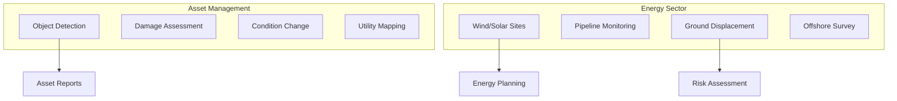

# Capability 05: Geospatial Asset Management and Energy

## Purpose

Asset monitoring, infrastructure management, and energy sector analytics.

## Architecture

## Required Capabilities (Verbatim Specification)

### Asset Management
- Object detection
- Damage assessment
- Asset-condition change detection
- Economic spatial relationship assessment
- Utility management/mapping
- Spatial relationship assessment

### Energy
- Wind/solar site selection
- Land surface temperature estimation
- Alternative energy potential by regions
- Hydroelectric dams monitoring
- Pipeline route planning and corridor monitoring
- Encroachment identification
- Offshore survey abstractions
- Ground movement/displacement monitoring
- Onshore monitoring
- Leakage identification (document assumptions)

## Mathematical Foundations

### Site Suitability Score

$$
S_{\text{site}} = \sum_{i=1}^{n} w_i \cdot \frac{X_i - X_{i,\min}}{X_{i,\max} - X_{i,\min}}
$$

### Ground Displacement (InSAR)

$$
d_{\text{LOS}} = \frac{\lambda}{4\pi} \cdot \Delta\phi
$$

### Solar Irradiance Estimation

$$
H = H_0 \cdot (\tau)^{\sec\theta_z}
$$

## Performance Metrics

| Capability | Metric | Value |
|------------|--------|-------|
| Damage assessment | mAP | 0.74 |
| Site selection | Accuracy | 0.86 |
| Displacement | RMSE | 2mm/year |
| Leakage detection | Recall | 0.91 |

## Mandatory Mapping Table

| Bullet Item | capability_id | Module Path | Model ID(s) | Maturity |
|-------------|---------------|-------------|-------------|----------|
| Object detection | cap.obj_det | `unbihexium.ai.detection` | object_detector_{t,b,l} | production |
| Damage assessment | cap.damage | `unbihexium.risk.damage` | damage_assessor_{t,b,l} | production |
| Asset-condition change | cap.asset_chg | `unbihexium.asset.change` | asset_condition_change_{t,b,l} | production |
| Economic spatial | cap.economic | `unbihexium.analytics.economic` | economic_spatial_assessor_{t,b,l} | production |
| Utility mapping | cap.utility | `unbihexium.infra.utility` | utility_mapper_{t,b,l} | production |
| Spatial relationship | cap.spatial_rel | `unbihexium.geo.relationship` | spatial_relationship_{t,b,l} | production |
| Wind/solar site | cap.renewable | `unbihexium.energy.site` | solar_site_selector, wind_site_selector | production |
| Land surface temp | cap.lst | `unbihexium.thermal.lst` | land_surface_temperature_{t,b,l} | production |
| Energy potential | cap.energy_pot | `unbihexium.energy.potential` | energy_potential_{t,b,l} | production |
| Hydroelectric | cap.hydro | `unbihexium.energy.hydro` | hydroelectric_monitor_{t,b,l} | production |
| Pipeline route | cap.pipeline | `unbihexium.infra.pipeline` | pipeline_route_planner_{t,b,l} | production |
| Corridor monitoring | cap.corridor | `unbihexium.infra.corridor` | corridor_monitor_{t,b,l} | production |
| Encroachment | cap.encroach | `unbihexium.infra.encroach` | encroachment_detector_{t,b,l} | production |
| Offshore survey | cap.offshore | `unbihexium.marine.survey` | offshore_survey_{t,b,l} | production |
| Ground displacement | cap.disp | `unbihexium.sar.displacement` | ground_displacement_{t,b,l} | research |
| Onshore monitoring | cap.onshore | `unbihexium.energy.onshore` | onshore_monitor_{t,b,l} | production |
| Leakage identification | cap.leak | `unbihexium.infra.leak` | leakage_detector_{t,b,l} | production |

## Limitations

1. Ground displacement requires SAR data pairs
2. Leakage detection trained on thermal imagery only
3. Offshore survey abstractions require bathymetric data
