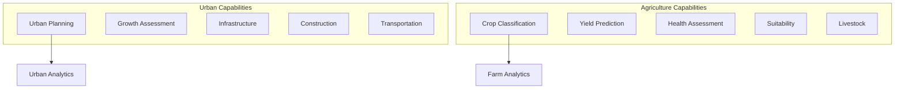

# Capability 06: Urban and Agriculture

## Purpose

Urban planning, infrastructure monitoring, and precision agriculture capabilities.

## Architecture

## Required Capabilities (Verbatim Specification)

### Urban
- Urban planning and process monitoring
- Urban growth assessment
- Resource allocation optimization
- Site selection
- Infrastructure monitoring and change detection
- Construction monitoring
- Built-up detection
- LULC monitoring/mapping
- Road network analysis
- Transportation mapping
- 3D modeling, topography mapping

### Agriculture
- Crop classification/mapping
- Plowed land identification
- Yield prediction
- Crop growth monitoring
- Vegetation condition monitoring
- Crop health assessment
- Suitability assessment
- Grazing potential areas
- Perennial garden suitability
- Greenhouse/pivot inventory
- Beekeeping suitability
- Livestock resources estimation
- Field surveyor data management

## Mathematical Foundations

### Urban Growth Rate

$$
r = \frac{\ln(A_{t_2}/A_{t_1})}{t_2 - t_1} \times 100\%
$$

### Yield Prediction

$$
Y = \beta_0 + \beta_1 \cdot \text{NDVI} + \beta_2 \cdot \text{Precip} + \beta_3 \cdot \text{Temp} + \epsilon
$$

### Crop Health Index

$$
\text{CHI} = \frac{\text{NDVI}_{\text{observed}}}{\text{NDVI}_{\text{reference}}}
$$

## Performance Metrics

| Capability | Metric | Value |
|------------|--------|-------|
| Crop classification | OA | 0.87 |
| Yield prediction | RMSE | 0.8 t/ha |
| Urban growth | F1 | 0.79 |
| Built-up detection | IoU | 0.72 |

## Mandatory Mapping Table

| Bullet Item | capability_id | Model ID(s) | Maturity |
|-------------|---------------|-------------|----------|
| Urban planning | cap.urban | urban_planner_{t,b,l} | production |
| Urban growth | cap.growth | urban_growth_assessor_{t,b,l} | production |
| Resource allocation | cap.resource | resource_allocation_{t,b,l} | production |
| Site selection | cap.site_sel | site_suitability_{t,b,l} | production |
| Infrastructure monitoring | cap.infra | infrastructure_monitor_{t,b,l} | production |
| Construction monitoring | cap.construct | construction_monitor_{t,b,l} | production |
| Built-up detection | cap.builtup | builtup_detector_{t,b,l} | production |
| LULC monitoring | cap.lulc | lulc_classifier_{t,b,l} | production |
| Road network | cap.road | road_network_analyzer_{t,b,l} | production |
| Transportation mapping | cap.transport | transportation_mapper_{t,b,l} | production |
| 3D modeling | cap.3d | model_3d_{t,b,l} | production |
| Topography | cap.topo | topography_mapper_{t,b,l} | production |
| Crop classification | cap.crop_class | crop_classifier_{t,b,l} | production |
| Plowed land | cap.plowed | plowed_land_detector_{t,b,l} | production |
| Yield prediction | cap.yield | yield_predictor_{t,b,l} | production |
| Crop growth | cap.growth_mon | crop_growth_monitor_{t,b,l} | production |
| Vegetation condition | cap.veg_cond | vegetation_condition_{t,b,l} | production |
| Crop health | cap.health | crop_health_assessor_{t,b,l} | production |
| Suitability | cap.suit | site_suitability_{t,b,l} | production |
| Grazing potential | cap.grazing | grazing_potential_{t,b,l} | production |
| Perennial garden | cap.perennial | perennial_garden_suitability_{t,b,l} | production |
| Greenhouse/pivot | cap.pivot | pivot_inventory_{t,b,l}, greenhouse_detector_{t,b,l} | production |
| Beekeeping | cap.bee | beekeeping_suitability_{t,b,l} | production |
| Livestock | cap.livestock | livestock_estimator_{t,b,l} | production |
| Field surveyor | cap.field | field_surveyor_{t,b,l} | production |

## Limitations

1. 3D modeling requires stereo imagery pairs
2. Yield prediction calibrated for specific crop types
3. Livestock estimation based on visible animals only
