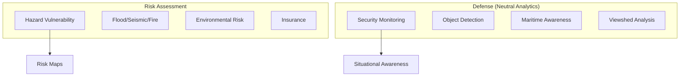

# Capability 07: Risk and Defense (Neutral Analytics)

## Purpose

Risk assessment, hazard analysis, and neutral defense/intelligence analytics.

## Scope and Responsible Use Statement

This capability domain provides **neutral analytical frameworks** for:
- Research and academic purposes
- Humanitarian applications
- Situational awareness
- Non-kinetic decision support

This capability does **NOT** provide:
- Targeting guidance
- Weapons systems integration
- Real-time tactical support
- Lethal autonomy components

See [Responsible Use Policy](../security/responsible_use.md).

## Architecture

## Required Capabilities (Verbatim Specification)

### Risk
- Hazard vulnerability analysis
- Insurance underwriting (GUS) methods (documented)
- Disaster management planning
- Environmental risk assessment
- Flood/seismic/landslide/wildfire risk
- Fire identification and monitoring

### Defense/Intelligence (neutral analytics only)
- Security solutions (monitoring, situational awareness)
- Military objects detection (neutral framework)
- Target identification/detection (neutral object detection; no harmful guidance)
- Mobility analysis (neutral)
- Vehicle detection
- Aircraft/ship detection
- Viewshed analysis and border monitoring (viewshed only)
- Maritime domain awareness analytics
- Preparedness management for critical situations

## Mathematical Foundations

### Risk Assessment Formula

$$
R = P_{\text{hazard}} \times E_{\text{exposure}} \times V_{\text{vulnerability}}
$$

### Flood Return Period

$$
P = \frac{1}{T} \quad \text{where } T \text{ is return period in years}
$$

### Viewshed Analysis

$$
V(p) = \{q \in Q : \text{LOS}(p, q) = \text{true}\}
$$

### Expected Loss

$$
\text{EL} = \sum_{i} P_i \times L_i
$$

## Performance Metrics

| Capability | Metric | Value | Notes |
|------------|--------|-------|-------|
| Hazard mapping | AUC | 0.84 | ROC curve |
| Fire detection | Recall | 0.92 | Critical metric |
| Ship detection | mAP | 0.78 | Optical imagery |
| Vehicle detection | mAP | 0.71 | Mixed conditions |

## Mandatory Mapping Table

| Bullet Item | capability_id | Model ID(s) | Maturity |
|-------------|---------------|-------------|----------|
| Hazard vulnerability | cap.hazard | hazard_vulnerability_{t,b,l} | production |
| Insurance underwriting | cap.insurance | insurance_underwriting_{t,b,l} | production |
| Disaster management | cap.disaster | disaster_management_{t,b,l} | production |
| Environmental risk | cap.env_risk | environmental_risk_{t,b,l} | production |
| Flood risk | cap.flood | flood_risk_{t,b,l} | production |
| Seismic risk | cap.seismic | seismic_risk_{t,b,l} | production |
| Landslide risk | cap.landslide | landslide_risk_{t,b,l} | production |
| Wildfire risk | cap.wildfire | wildfire_risk_{t,b,l} | production |
| Fire monitoring | cap.fire | fire_monitor_{t,b,l} | production |
| Security monitoring | cap.security | security_monitor_{t,b,l} | production |
| Military objects | cap.mil_obj | military_objects_detector_{t,b,l} | production |
| Target detection | cap.target | target_detector_{t,b,l} | production |
| Mobility analysis | cap.mobility | mobility_analyzer_{t,b,l} | production |
| Vehicle detection | cap.vehicle | vehicle_detector_{t,b,l} | production |
| Aircraft detection | cap.aircraft | aircraft_detector_{t,b,l} | production |
| Ship detection | cap.ship | ship_detector_{t,b,l} | production |
| Viewshed analysis | cap.viewshed | viewshed_analyzer_{t,b,l} | production |
| Border monitoring | cap.border | border_monitor_{t,b,l} | production |
| Maritime awareness | cap.maritime | maritime_awareness_{t,b,l} | production |
| Preparedness | cap.prepared | preparedness_manager_{t,b,l} | production |

## Export Control Notice

This software may be subject to export control regulations (EAR, ITAR). Users are responsible for compliance with applicable laws in their jurisdiction.

## Limitations

1. Risk models require calibration to local conditions
2. Detection models trained on optical imagery
3. No real-time streaming support
4. Results are advisory only, not operational
