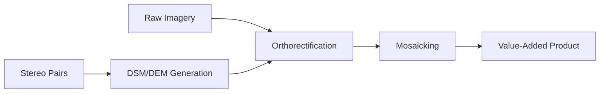

# Capability 08: Value-Added Imagery

## Purpose

Orthorectification, terrain modeling, and mosaicking for value-added imagery products.

## Architecture

## Required Capabilities (Verbatim Specification)

- DSM vs DEM handling/generation utilities
- Orthorectification
- Mosaicking

## Mathematical Foundations

### Digital Surface Model vs Digital Elevation Model

$$
\text{DSM} = \text{Ground} + \text{Surface Objects}
$$

$$
\text{DEM} = \text{Ground Elevation Only}
$$

$$
\text{Height Above Ground} = \text{DSM} - \text{DEM}
$$

### Orthorectification

Collinearity equations:

$$
x = x_0 - f \cdot \frac{r_{11}(X-X_0) + r_{12}(Y-Y_0) + r_{13}(Z-Z_0)}{r_{31}(X-X_0) + r_{32}(Y-Y_0) + r_{33}(Z-Z_0)}
$$

### Mosaic Blending

$$
I_{\text{blend}} = \alpha \cdot I_1 + (1-\alpha) \cdot I_2
$$

## Performance Metrics

| Capability | Metric | Value | Notes |
|------------|--------|-------|-------|
| Orthorectification | RMSE | < 1 pixel | Subpixel accuracy |
| DSM Generation | Vertical accuracy | 1m CE90 | Stereo-derived |
| Mosaicking | Seamline visibility | Low | Color-balanced |

## Mandatory Mapping Table

| Bullet Item | capability_id | Module Path | Model ID(s) | Maturity |
|-------------|---------------|-------------|-------------|----------|
| DSM generation | cap.dsm | `unbihexium.terrain.dsm` | dsm_generator_{t,b,l} | production |
| DEM generation | cap.dem | `unbihexium.terrain.dem` | dem_generator_{t,b,l} | production |
| DTM generation | cap.dtm | `unbihexium.terrain.dtm` | dtm_generator_{t,b,l} | production |
| Orthorectification | cap.ortho | `unbihexium.processing.ortho` | orthorectification_{t,b,l} | production |
| Mosaicking | cap.mosaic | `unbihexium.processing.mosaic` | mosaicking_{t,b,l} | production |

## Limitations

1. DSM requires stereo imagery pairs
2. Orthorectification requires RPC or camera model
3. Large-area mosaics memory-intensive
