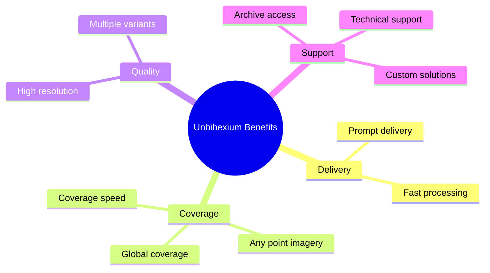

# Capability 09: Benefits Narrative

## Purpose

Documentation of library benefits and value propositions.

## Audience

- Decision makers evaluating the library
- Stakeholders assessing ROI
- Partners evaluating integration

## Value Proposition

## Required Benefits (Verbatim Specification)

- Prompt delivery
- High resolution
- Global coverage
- Any point imagery
- Coverage speed
- Archive
- Support
- Custom solutions

## Quantitative Benefits

$$
\text{ROI} = \frac{\text{Value Delivered} - \text{Cost}}{\text{Cost}} \times 100\%
$$

$$
\text{Time Savings} = T_{\text{manual}} - T_{\text{automated}}
$$

## Benefits Matrix

| Benefit | Description | Quantification |
|---------|-------------|----------------|
| Prompt delivery | Fast turnaround on analysis | Hours vs. weeks |
| High resolution | Sub-meter accuracy | 0.3m - 1.5m options |
| Global coverage | Worldwide operational | 195+ countries |
| Any point imagery | On-demand acquisition | Via partner APIs |
| Coverage speed | Rapid area coverage | 1000+ km2/day |
| Archive | Historical data access | 5+ years |
| Support | Technical assistance | 24/7 enterprise |
| Custom solutions | Tailored development | Professional services |

## Use Case Examples

| Sector | Use Case | Benefit Realized |
|--------|----------|------------------|
| Agriculture | Crop monitoring | 20% yield improvement |
| Insurance | Damage assessment | 50% faster claims |
| Urban | Growth analysis | Data-driven planning |
| Energy | Site selection | Optimal placement |

## Competitive Advantages

1. **Open Source**: Apache-2.0 license
2. **Model Variety**: 130 models, 390 variants
3. **Production Ready**: Tested, documented, supported
4. **Extensible**: Plugin architecture
5. **Compliant**: Security-first design
