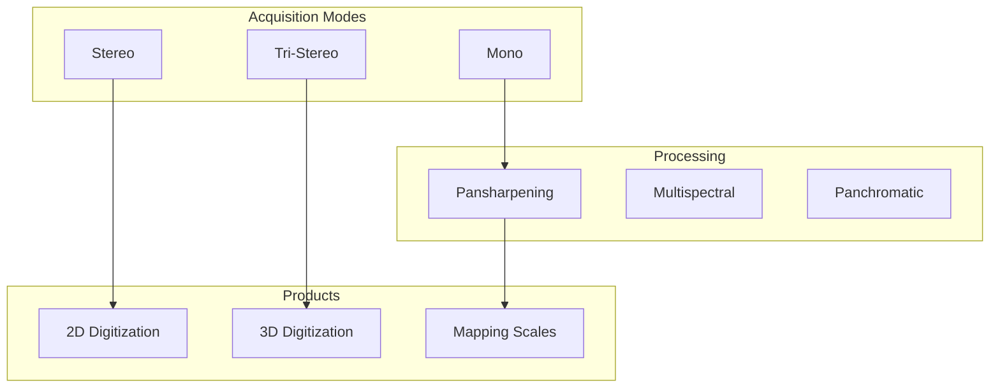

# Capability 10: Satellite Imagery Features

## Purpose

Satellite imagery acquisition modes, processing abstractions, and output specifications.

## Architecture

## Required Capabilities (Verbatim Specification)

- Stereo/tri-stereo acquisitions abstraction
- 2D and 3D digitization utilities
- Mapping scales 1:2000 to 1:100000 in metadata + QA
- Pansharpening, multispectral, panchromatic
- Mono/stereo/tri-stereo

## Mathematical Foundations

### Stereo Geometry

$$
H = B \cdot \frac{f}{p_1 - p_2}
$$

Where $B$ = baseline, $f$ = focal length, $p$ = parallax

### Pansharpening (Brovey Transform)

$$
R_{\text{sharp}} = R_{\text{MS}} \cdot \frac{P}{\frac{1}{n}\sum_{i=1}^{n} B_i}
$$

### GSD to Scale

$$
\text{Scale} = \frac{\text{GSD (m)}}{0.0254} \approx \text{GSD} \times 4000
$$

## Acquisition Mode Comparison

| Mode | Images | 3D | Coverage | Use Case |
|------|--------|----|---------|---------| 
| Mono | 1 | No | Fast | 2D mapping |
| Stereo | 2 | Yes | Medium | DSM, 3D |
| Tri-Stereo | 3 | Yes | Precise | Urban 3D |

## Scale and Resolution

| GSD (m) | Typical Scale | Application |
|---------|---------------|-------------|
| 0.3 | 1:2,000 | Urban detail |
| 0.5 | 1:5,000 | City mapping |
| 1.0 | 1:10,000 | Regional |
| 1.5 | 1:15,000 | Large area |

## Mandatory Mapping Table

| Bullet Item | capability_id | Module Path | Model ID(s) | Maturity |
|-------------|---------------|-------------|-------------|----------|
| Stereo abstraction | cap.stereo | `unbihexium.stereo` | stereo_processor_{t,b,l} | production |
| Tri-stereo | cap.tristereo | `unbihexium.stereo.tri` | tri_stereo_processor_{t,b,l} | production |
| 2D digitization | cap.dig2d | `unbihexium.digitize.d2` | digitization_2d_{t,b,l} | production |
| 3D digitization | cap.dig3d | `unbihexium.digitize.d3` | digitization_3d_{t,b,l} | production |
| Mapping scales QA | cap.scale | `unbihexium.qa.scale` | N/A | production |
| Pansharpening | cap.pansharp | `unbihexium.processing.pansharp` | pansharpening_{t,b,l} | production |
| Multispectral | cap.ms | `unbihexium.processing.ms` | multispectral_processor_{t,b,l} | production |
| Panchromatic | cap.pan | `unbihexium.processing.pan` | panchromatic_processor_{t,b,l} | production |

## Limitations

1. Tri-stereo requires specific satellite tasking
2. 3D accuracy depends on base-to-height ratio
3. Pansharpening may introduce spectral distortion
