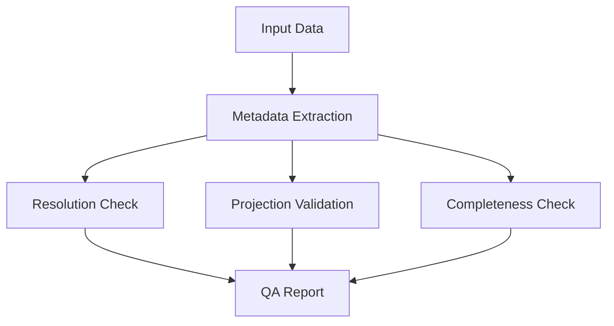

# Capability 11: Resolution and Metadata QA

## Purpose

Resolution options, metadata validation, and quality assurance.

## Architecture

## Required Capabilities (Verbatim Specification)

Resolution options:
- 0.3 m
- 0.5 m
- 1 m
- 1.5 m

## Mathematical Foundations

### Ground Sampling Distance

$$
\text{GSD} = \frac{H \cdot p}{f}
$$

Where $H$ = altitude, $p$ = pixel size, $f$ = focal length

### Resolution Enhancement Factor

$$
\text{Enhancement} = \frac{\text{GSD}_{\text{input}}}{\text{GSD}_{\text{output}}}
$$

### Quality Score

$$
Q = \prod_{i=1}^{n} q_i^{w_i} \quad \text{where } \sum w_i = 1
$$

## Resolution Specifications

| Resolution | GSD | Typical Sensor | Coverage | Cost |
|------------|-----|----------------|----------|------|
| 0.3 m | 30 cm | WorldView-3 | Urban | High |
| 0.5 m | 50 cm | WorldView-2 | Regional | Medium |
| 1.0 m | 100 cm | Sentinel-2 PAN | National | Low |
| 1.5 m | 150 cm | SPOT-6/7 | Continental | Low |

## QA Checklist

| Check | Requirement | Pass Criteria |
|-------|-------------|---------------|
| Resolution | Matches specification | Exact match |
| CRS | Valid projection | EPSG present |
| Bounds | Within AOI | 100% overlap |
| Bands | Expected count | Band count matches |
| NoData | Properly set | NoData defined |
| Radiometry | Calibrated | DN to reflectance |

## Metadata Schema

| Field | Type | Required | Description |
|-------|------|----------|-------------|
| gsd | float | Yes | Ground sampling distance (m) |
| crs | string | Yes | EPSG code |
| bounds | array | Yes | [minx, miny, maxx, maxy] |
| acquisition_date | string | Yes | ISO-8601 format |
| sensor | string | Yes | Sensor name |
| cloud_cover | float | No | Percentage 0-100 |

## Mandatory Mapping Table

| Resolution | capability_id | Validation Rule | QA Script |
|------------|---------------|-----------------|-----------|
| 0.3 m | cap.res030 | gsd <= 0.35 | `scripts/qa_resolution.py` |
| 0.5 m | cap.res050 | gsd <= 0.55 | `scripts/qa_resolution.py` |
| 1.0 m | cap.res100 | gsd <= 1.05 | `scripts/qa_resolution.py` |
| 1.5 m | cap.res150 | gsd <= 1.55 | `scripts/qa_resolution.py` |

## Limitations

1. Resolution enhancement beyond 4x not recommended
2. Metadata must be embedded or sidecar
3. Cloud cover thresholds user-configurable
