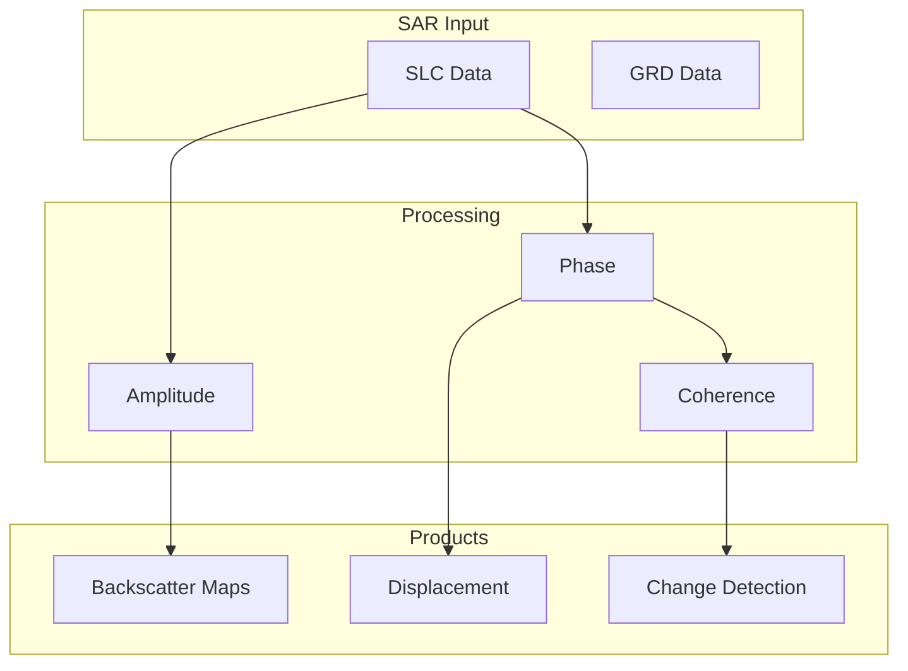

# Capability 12: Radar and SAR

## Purpose

Synthetic Aperture Radar (SAR) processing, amplitude analytics, and interferometric workflows.

## Scope

Research-grade SAR capabilities with documented limitations.

## Architecture

## Required Capabilities (Verbatim Specification)

- SAR IO/preprocessing scaffolding
- Amplitude analytics
- Phase component displacement demo (InSAR-style; research-grade if not validated)
- Severe weather/night narrative with constraints
- "Hidden object" wording must be scientifically constrained; no overclaim
- Mapping/monitoring workflows

## Mathematical Foundations

### SAR Backscatter

$$
\sigma^0 = \frac{4\pi}{A} \cdot |S|^2
$$

### Interferometric Phase

$$
\Delta\phi = \phi_1 - \phi_2 = \frac{4\pi}{\lambda} \cdot d_{\text{LOS}}
$$

### Coherence

$$
\gamma = \frac{|\langle s_1 \cdot s_2^* \rangle|}{\sqrt{\langle |s_1|^2 \rangle \langle |s_2|^2 \rangle}}
$$

### Line-of-Sight Displacement

$$
d_{\text{LOS}} = \frac{\lambda \cdot \Delta\phi}{4\pi}
$$

## SAR Advantages

| Feature | Optical | SAR |
|---------|---------|-----|
| Cloud penetration | No | Yes |
| Night operation | No | Yes |
| All-weather | No | Yes |
| Subsurface | No | Limited |

## Scientific Constraints

SAR capabilities have important limitations:

| Claim | Reality | Constraint |
|-------|---------|------------|
| "Hidden object detection" | Subsurface penetration limited | Depends on wavelength, moisture |
| Phase displacement | Requires atmospheric correction | Research-grade accuracy |
| Coherence | Temporal decorrelation | Short temporal baseline needed |

## Mandatory Mapping Table

| Bullet Item | capability_id | Module Path | Model ID(s) | Maturity |
|-------------|---------------|-------------|-------------|----------|
| SAR I/O | cap.sar_io | `unbihexium.sar.io` | N/A | production |
| Amplitude analytics | cap.sar_amp | `unbihexium.sar.amplitude` | sar_amplitude_{t,b,l} | production |
| Phase displacement | cap.sar_phase | `unbihexium.sar.phase` | sar_phase_displacement_{t,b,l} | research |
| Subsidence | cap.sar_subs | `unbihexium.sar.subsidence` | sar_subsidence_monitor_{t,b,l} | research |
| SAR flood detection | cap.sar_flood | `unbihexium.sar.flood` | sar_flood_detector_{t,b,l} | production |
| SAR oil spill | cap.sar_oil | `unbihexium.sar.oil` | sar_oil_spill_detector_{t,b,l} | production |
| SAR ship detection | cap.sar_ship | `unbihexium.sar.ship` | sar_ship_detector_{t,b,l} | production |
| SAR mapping workflow | cap.sar_map | `unbihexium.sar.mapping` | sar_mapping_workflow_{t,b,l} | production |

## Weather/Night Narrative

SAR sensors can operate in:
- **Severe weather**: Cloud, rain (C-band and longer)
- **Night conditions**: Active illumination

However:
- Heavy precipitation affects C-band
- X-band sensitive to rain
- Quality depends on incidence angle

## Limitations

1. InSAR requires SLC data pairs
2. Atmospheric effects require correction
3. Phase unwrapping is research-grade
4. Subsurface detection highly constrained
5. Temporal decorrelation limits revisit intervals

## References

1. Rosen, P.A. et al. (2000). Synthetic Aperture Radar Interferometry. Proc. IEEE.
2. Ferretti, A. et al. (2001). Permanent scatterers in SAR interferometry. IEEE TGRS.
