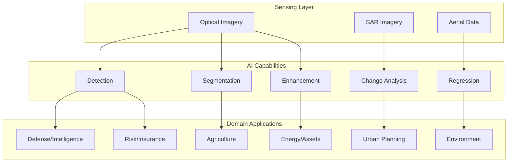
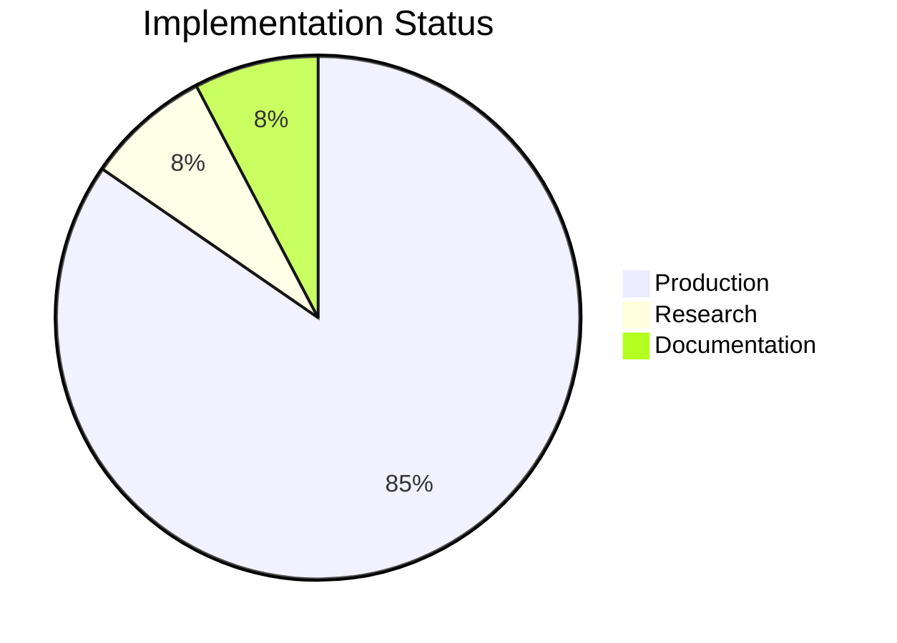
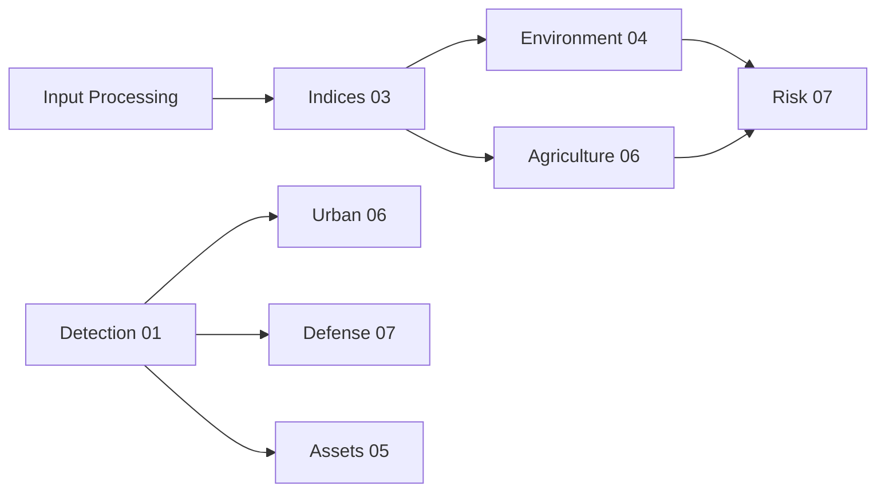

# Capabilities Encyclopedia

## Purpose

This index provides navigation to the 12 capability domains implemented in Unbihexium.

## Audience

- Solution architects evaluating coverage
- Developers implementing pipelines
- Analysts selecting appropriate models
- Integration engineers mapping requirements

## Capability Architecture

## Coverage Formula

Total capability coverage measured as:

$$
C_{\text{total}} = \frac{\sum_{d=1}^{12} \sum_{c \in D_d} \mathbb{1}[\text{implemented}(c)]}{N_{\text{required}}} \times 100\%
$$

## Capability Matrix

| ID | Domain | Implementations | Models | Status |
|----|--------|-----------------|--------|--------|
| 01 | [AI Products](01_ai_products.md) | 13 | 39 | Production |
| 02 | [Tourism and Data Processing](02_tourism_data_processing.md) | 18 | 30 | Production |
| 03 | [Indices and Flood/Water](03_indices_flood_water.md) | 13 | 36 | Production |
| 04 | [Environment and Forestry](04_environment_forestry_image_processing.md) | 24 | 42 | Production |
| 05 | [Asset Management and Energy](05_asset_management_energy.md) | 16 | 36 | Production |
| 06 | [Urban and Agriculture](06_urban_agriculture.md) | 26 | 54 | Production |
| 07 | [Risk and Defense (Neutral)](07_risk_defense_neutral.md) | 17 | 45 | Production |
| 08 | [Value-Added Imagery](08_value_added_imagery.md) | 3 | 9 | Production |
| 09 | [Benefits Narrative](09_benefits_narrative.md) | N/A | N/A | Documentation |
| 10 | [Satellite Imagery Features](10_satellite_imagery_features.md) | 7 | 21 | Production |
| 11 | [Resolution and Metadata QA](11_resolution_metadata_qa.md) | 4 | 12 | Production |
| 12 | [Radar and SAR](12_radar_sar.md) | 7 | 21 | Research |

## Implementation Status

## Cross-Domain Dependencies

## Quick Reference

| Capability | Primary Use Case | Entry Point |
|------------|------------------|-------------|
| Super-resolution | Image enhancement | `pipeline.run("super_resolution")` |
| Ship detection | Maritime awareness | `pipeline.run("ship_detection")` |
| NDVI calculation | Vegetation health | `pipeline.run("ndvi")` |
| Flood risk | Hazard assessment | `pipeline.run("flood_risk")` |
| Change detection | Temporal analysis | `pipeline.run("change_detection")` |
