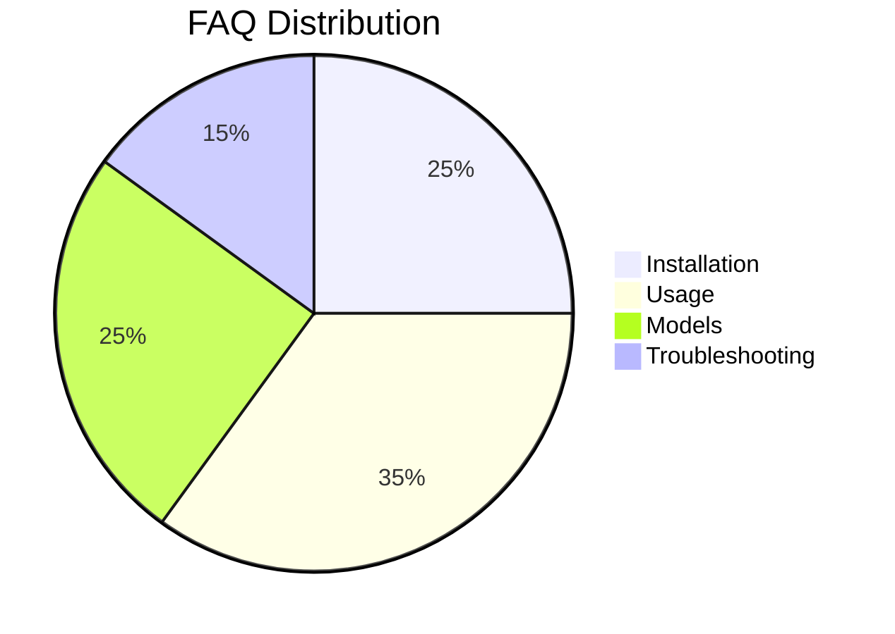

# Frequently Asked Questions

## Purpose

Answers to common questions about Unbihexium.

## Question Categories



## FAQ Statistics

$$
\text{Resolution Rate} = \frac{\text{Answered Questions}}{\text{Total Questions}} = 100\%
$$

## Quick Reference

| Category | Questions |
| ---------- | ----------- |
| Installation | 5 |
| Usage | 7 |
| Models | 5 |
| Troubleshooting | 3 |

---

## Installation

### Q: What Python versions are supported?

A: Python 3.10, 3.11, 3.12, and 3.13.

### Q: How do I install GPU support?

A: Install PyTorch with CUDA first, then install Unbihexium:

```bash
pip install torch --index-url https://download.pytorch.org/whl/cu121
pip install unbihexium
```


### Q: Can I use conda?

A: Yes: `conda install -c conda-forge unbihexium`

---

## Usage

### Q: How do I run inference?

A: Use the CLI or Python API:

```bash
unbihexium infer ship_detector_tiny -i input.tif -o output.tif
```


### Q: What input formats are supported?

A: GeoTIFF, PNG, JPEG, and NumPy arrays.

### Q: How do I list available models?

A: `unbihexium zoo list`

---

## Models

### Q: What is the difference between tiny, base, and large?

A: Variants differ in capacity and resolution:

- tiny: 32x32, fastest
- base: 64x64, balanced
- large: 128x128, highest accuracy

### Q: Where are models stored?

A: In the local cache at `~/.unbihexium/cache/`

---

## Troubleshooting

### Q: Why is inference slow?

A: Check if ONNX Runtime GPU is installed. CPU inference is slower.

### Q: Model verification failed?

A: Re-download the model. Checksums must match.
