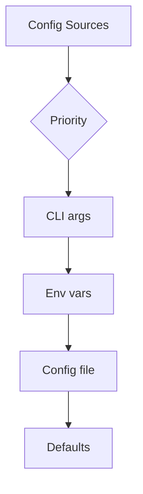

# Configuration

## Purpose

Configure Unbihexium for different use cases.

## Configuration Flow



## Priority Order

$$
\text{Final Value} = \max_{\text{priority}}(\text{CLI}, \text{ENV}, \text{File}, \text{Default})
$$

## Configuration Options

| Option | Type | Default | Description |
| -------- | ------ | --------- | ------------- |
| `model_dir` | path | ~/.unbihexium | Model cache |
| `device` | str | auto | cpu, cuda, auto |
| `batch_size` | int | 1 | Inference batch |
| `tile_size` | int | 256 | Tile dimensions |
| `overlap` | int | 32 | Tile overlap |

## Environment Variables

```bash
export UNBIHEXIUM_MODEL_DIR=/path/to/models
export UNBIHEXIUM_DEVICE=cuda
export UNBIHEXIUM_BATCH_SIZE=4
```

## Configuration File

Create `~/.unbihexium/config.yaml`:

```yaml
model_dir: /path/to/models
device: cuda
batch_size: 4
tile_size: 512
overlap: 64
logging:
  level: INFO
  format: json
```

## CLI Override

```bash
unbihexium infer model_id -i input.tif -o output.tif \
  --device cuda \
  --batch-size 8
```

## Python Configuration

```python
from unbihexium import Config

config = Config(
    device="cuda",
    batch_size=4,
    tile_size=512
)

pipeline = Pipeline.from_config("detection", config=config)
```

## Logging Configuration

| Level | Use Case |
| ------- | ---------- |
| DEBUG | Development |
| INFO | Normal operation |
| WARNING | Potential issues |
| ERROR | Failures only |

## Next Steps

- [Tutorials](../tutorials/index.md)
- [API Reference](../reference/api.md)
