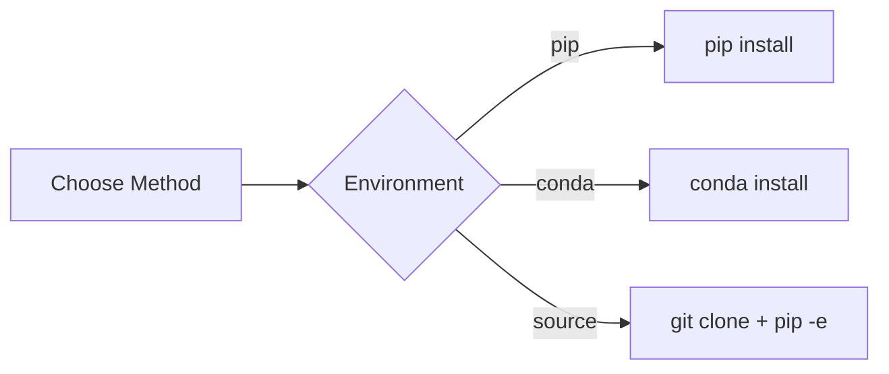

# Installation

## Purpose

Install Unbihexium and its dependencies.

## Prerequisites

- Python 3.10 or higher
- pip or conda package manager
- 8GB RAM minimum (16GB recommended)
- Optional: NVIDIA GPU with CUDA

## Installation Methods



## System Requirements

$$
\text{Memory} \geq 8\text{GB} + N_{\text{models}} \times 50\text{MB}
$$

| Component | Minimum | Recommended |
|-----------|---------|-------------|
| Python | 3.10 | 3.12 |
| RAM | 8GB | 16GB |
| Disk | 5GB | 20GB |
| GPU | None | CUDA 11.8+ |

## Quick Install

```bash
pip install unbihexium
```

## Install with GPU Support

```bash
# Install PyTorch with CUDA first
pip install torch --index-url https://download.pytorch.org/whl/cu121

# Then install Unbihexium
pip install unbihexium
```

## Conda Installation

```bash
conda install -c conda-forge unbihexium
```

## Development Installation

```bash
git clone https://github.com/unbihexium-oss/unbihexium.git
cd unbihexium
pip install -e ".[dev]"
```

## Verify Installation

```bash
unbihexium --version
```

```python
import unbihexium
print(unbihexium.__version__)
```

## Troubleshooting

| Issue | Solution |
|-------|----------|
| Import error | Reinstall package |
| CUDA not found | Install PyTorch with CUDA |
| Memory error | Reduce batch size |

## Next Steps

- [Quickstart](quickstart.md)
- [Configuration](configuration.md)
