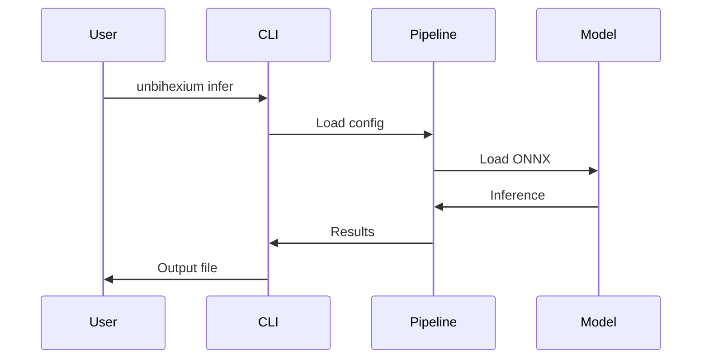

# Quickstart

## Purpose

Get started with Unbihexium in 5 minutes.

## Audience

New users wanting to run their first pipeline.

## Workflow Overview



## Processing Time

$$
T_{\text{total}} = T_{\text{load}} + N_{\text{tiles}} \times T_{\text{inference}}
$$

## Steps Summary

| Step | Command | Time |
|------|---------|------|
| 1. Install | `pip install unbihexium` | 1 min |
| 2. List models | `unbihexium zoo list` | 1 sec |
| 3. Run inference | `unbihexium infer ...` | varies |

## Step 1: Install

```bash
pip install unbihexium
```

## Step 2: List Available Models

```bash
unbihexium zoo list
```

Output shows 130 models with 3 variants each.

## Step 3: Run Inference

```bash
# Detect ships in an image
unbihexium infer ship_detector_tiny -i input.tif -o output.tif
```

## Python API

```python
from unbihexium import Pipeline

# Load pipeline
pipeline = Pipeline.from_config("detection")

# Run on image
results = pipeline.run("input.tif")

# Save results
results.save("output.tif")
```

## Example with Model Zoo

```python
from unbihexium.zoo import get_model

# Get model path
model = get_model("ship_detector_tiny")

# Use with ONNX Runtime
import onnxruntime as ort
session = ort.InferenceSession(model.path)
```

## Next Steps

- [Configuration](configuration.md)
- [Tutorials](../tutorials/index.md)
