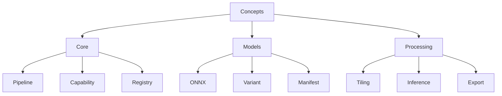

# Glossary

## Purpose

Definitions of key terms used in Unbihexium documentation.

## Term Hierarchy

## Term Count

$$
N_{\text{terms}} = \sum_{c \in \text{Categories}} |T_c|
$$

## Core Concepts

| Term | Definition |
|------|------------|
| Pipeline | Sequence of processing stages for data transformation |
| Capability | Named feature or function provided by the library |
| Registry | Central index of available capabilities and models |
| Inference | Process of running a model on input data |

## Model Terms

| Term | Definition |
|------|------------|
| ONNX | Open Neural Network Exchange format |
| Variant | Model size configuration (tiny, base, large) |
| Manifest | JSON file describing model metadata |
| Checkpoint | Saved model weights in training format |

## Geospatial Terms

| Term | Definition |
|------|------------|
| GeoTIFF | Georeferenced TIFF image format |
| CRS | Coordinate Reference System |
| Raster | Grid-based data representation |
| Vector | Point, line, polygon data |
| Tile | Rectangular subset of larger image |

## Processing Terms

| Term | Definition |
|------|------------|
| Tiling | Dividing large images into smaller tiles |
| Mosaicking | Combining multiple images into one |
| Orthorectification | Correcting geometric distortions |
| Pansharpening | Enhancing resolution using panchromatic band |

## Index Terms

| Term | Definition |
|------|------------|
| NDVI | Normalized Difference Vegetation Index |
| NDWI | Normalized Difference Water Index |
| NBR | Normalized Burn Ratio |
| EVI | Enhanced Vegetation Index |
| SAVI | Soil-Adjusted Vegetation Index |
