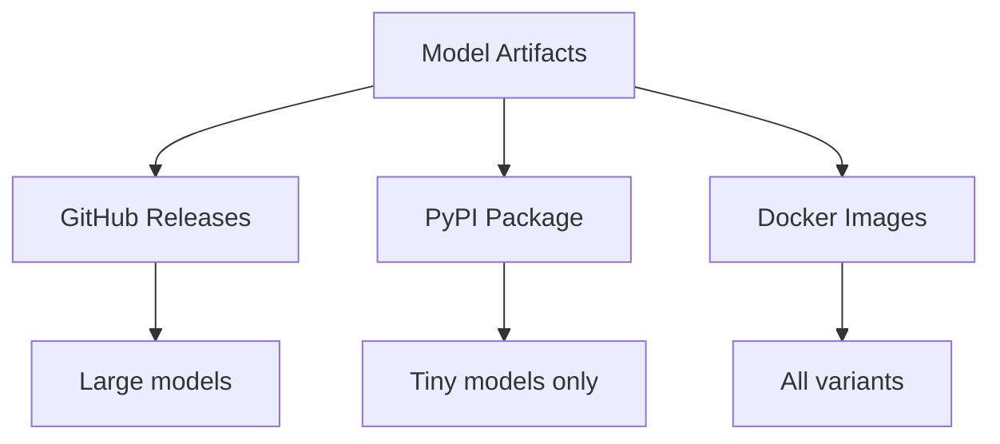

# Model Distribution

## Purpose

Strategy for distributing model artifacts.

## Distribution Architecture



## Size Analysis

$$
\text{Total Size} = \sum_{m \in M} \sum_{v \in V} \text{Size}(m, v)
$$

| Variant | Avg Size | Count | Total |
| --------- | ---------- | ------- | ------- |
| tiny | 15 KB | 130 | 2 MB |
| base | 60 KB | 130 | 8 MB |
| large | 200 KB | 130 | 26 MB |

## Distribution Channels

| Channel | Content | Size Limit |
| --------- | --------- | ------------ |
| PyPI | tiny only | < 50 MB |
| GitHub Releases | all | 2 GB/release |
| Docker Hub | all | No limit |
| Manual download | all | N/A |

## GitHub Release Structure

```
v1.0.0/
  unbihexium-models-tiny.zip
  unbihexium-models-base.zip
  unbihexium-models-large.zip
  checksums.sha256
```

## Docker Images

```bash
docker pull ghcr.io/unbihexium-oss/unbihexium:latest
docker pull ghcr.io/unbihexium-oss/unbihexium:1.0.0-models
```
