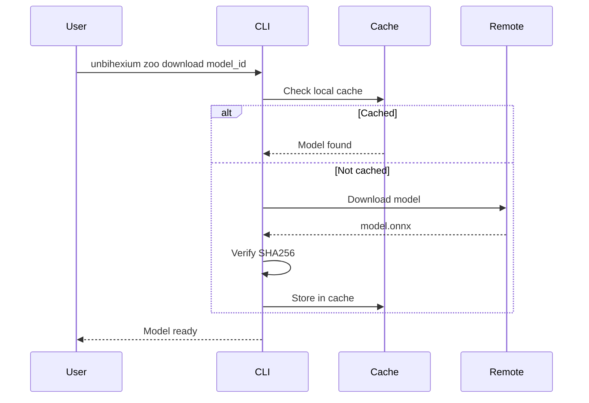

# Download and Verify Models

## Purpose

Guide to downloading and verifying model integrity.

## Download Flow



## Verification Formula

$$
\text{Valid} = \begin{cases}
\text{true} & \text{if } H(m) = H_{\text{expected}} \\
\text{false} & \text{otherwise}
\end{cases}
$$

## Download Methods

| Method | Command | Notes |
|--------|---------|-------|
| CLI | `unbihexium zoo download model_id` | Recommended |
| Python | `zoo.download_model("model_id")` | Programmatic |
| Manual | Download from releases | Advanced |

## CLI Usage

```bash
# Download single model
unbihexium zoo download ship_detector_base

# Download all variants
unbihexium zoo download ship_detector --all-variants

# Download and verify
unbihexium zoo download ship_detector_base --verify
```

## Python API

```python
from unbihexium.zoo import download_model, verify_model

# Download
path = download_model("ship_detector_base")

# Verify
is_valid = verify_model("ship_detector_base")
assert is_valid
```

## Cache Location

| OS | Path |
|----|------|
| Linux | `~/.unbihexium/cache/` |
| Windows | `%USERPROFILE%/.unbihexium/cache/` |
| macOS | `~/.unbihexium/cache/` |

## Verification Failures

| Issue | Resolution |
|-------|------------|
| Hash mismatch | Re-download model |
| Missing .sha256 | Report issue |
| Corrupted file | Clear cache, retry |
