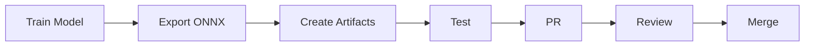

# How to Add Models

## Purpose

Guide for contributing new models to the zoo.

## Contribution Flow



## Quality Requirements

$$
\text{Accepted} = \text{Tests Pass} \land \text{Metrics Meet Threshold} \land \text{Docs Complete}
$$

| Requirement | Threshold |
| ------------- | ----------- |
| Test coverage | 80%+ |
| Metrics (mAP/IoU) | Domain-specific |
| Documentation | Complete |
| Verification | SHA256 |

## Step-by-Step

### 1. Train Model

```python
model = YourModel()
# Train on dataset
model.fit(train_data)
```

### 2. Export to ONNX

```python
import torch

torch.onnx.export(
    model,
    dummy_input,
    "model.onnx",
    opset_version=14
)
```

### 3. Create Artifacts

```
model_zoo/assets/{variant}/{model_id}/
  model.onnx
  config.json
  labels.json
  metrics.json
  model.sha256
```

### 4. Generate SHA256

```bash
sha256sum model.onnx > model.sha256
```

### 5. Create Manifest

Add to `model_zoo/manifests/{model_id}.json`

### 6. Create Model Card

Add to `model_zoo/cards/{model_id}.md`

### 7. Update Inventory

Add to `model_zoo/inventory.yaml`

### 8. Submit PR

Open PR with all artifacts.
