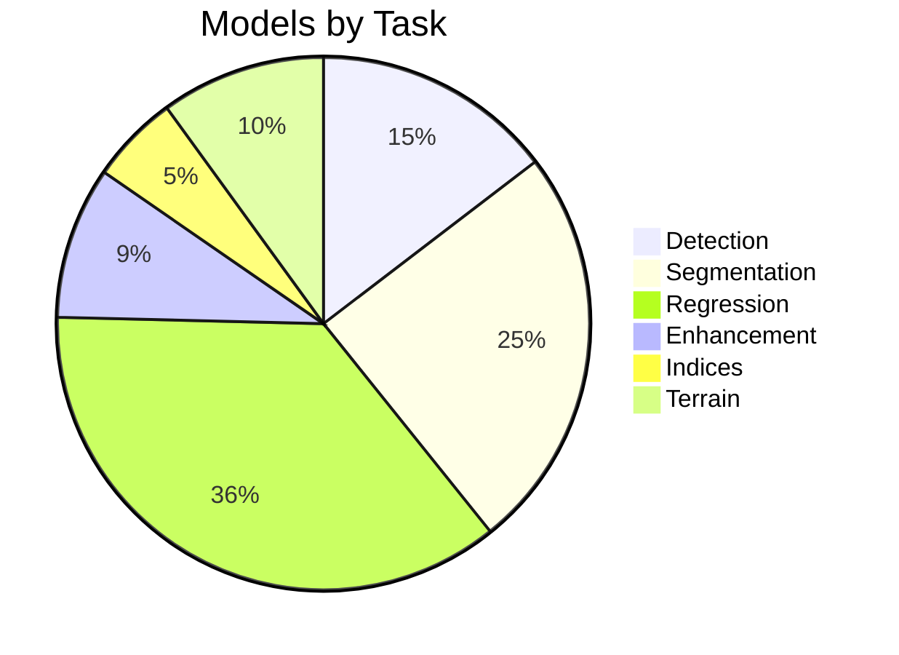

# Model Catalog

## Purpose

Complete catalog of 130 models with 390 variants in the Unbihexium Model Zoo.

## Model Distribution



## Variant Specifications

$$
\text{Parameters}(v) = \text{Base} \times \text{Capacity}(v)
$$

| Variant | Resolution | Capacity | Use Case |
|---------|------------|----------|----------|
| tiny | 32x32 | 0.25x | Edge, testing |
| base | 64x64 | 1.0x | Production |
| large | 128x128 | 2.0x | High accuracy |

## Detection Models (19)

| Model ID | Description | Classes |
|----------|-------------|---------|
| aircraft_detector | Aircraft detection | 1 |
| building_detector | Building footprints | 1 |
| ship_detector | Maritime vessels | 1 |
| vehicle_detector | Ground vehicles | 1 |
| damage_assessor | Damage detection | 4 |
| fire_monitor | Active fire | 1 |
| greenhouse_detector | Greenhouses | 1 |
| military_objects_detector | Military assets (neutral) | 5 |
| object_detector | Generic objects | 10 |

## Segmentation Models (32)

| Model ID | Description | Classes |
|----------|-------------|---------|
| change_detector | Bi-temporal change | 2 |
| cloud_mask | Cloud/shadow mask | 3 |
| crop_classifier | Crop types | 10 |
| lulc_classifier | Land use/cover | 8 |
| water_surface_detector | Water bodies | 2 |

## Index Calculators (7)

| Model ID | Formula | Range |
|----------|---------|-------|
| ndvi_calculator | (NIR-Red)/(NIR+Red) | [-1, 1] |
| ndwi_calculator | (Green-NIR)/(Green+NIR) | [-1, 1] |
| evi_calculator | Enhanced VI | [-1, 1] |
| nbr_calculator | Burn ratio | [-1, 1] |
| savi_calculator | Soil-adjusted VI | [-1, 1] |

## CLI Access

```bash
# List all models
unbihexium zoo list

# Search models
unbihexium zoo list --task detection

# Get model info
unbihexium zoo info ship_detector_base
```
