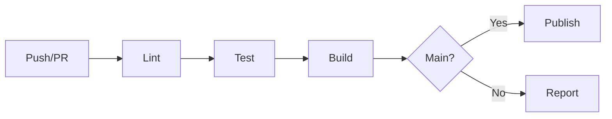

# CI/CD Pipeline

## Purpose

Continuous integration and deployment pipeline documentation.

## Pipeline Architecture



## Quality Gates

$$
\text{Pass} = \text{Lint} \land \text{Test} \land \text{Build} \land \text{Coverage} \geq 80\%
$$

| Gate | Tool | Threshold |
|------|------|-----------|
| Lint | ruff | No errors |
| Type check | pyright | Strict |
| Tests | pytest | All pass |
| Coverage | pytest-cov | 80%+ |
| Security | bandit | No high |

## Workflows

| Workflow | Trigger | Jobs |
|----------|---------|------|
| CI | Push, PR | lint, test, build |
| Release | Tag v* | publish |
| Docs | Push docs/ | deploy-docs |
| CodeQL | Schedule | security-scan |

## CI Workflow

```yaml
name: CI
on: [push, pull_request]
jobs:
  lint:
    runs-on: ubuntu-latest
    steps:
      - uses: actions/checkout@v4
      - uses: astral-sh/ruff-action@v1
  test:
    runs-on: ubuntu-latest
    steps:
      - uses: actions/checkout@v4
      - run: pip install -e ".[test]"
      - run: pytest tests/ --cov
```

## Environment Secrets

See [Secrets and Tokens](../security/secrets_and_tokens.md)
