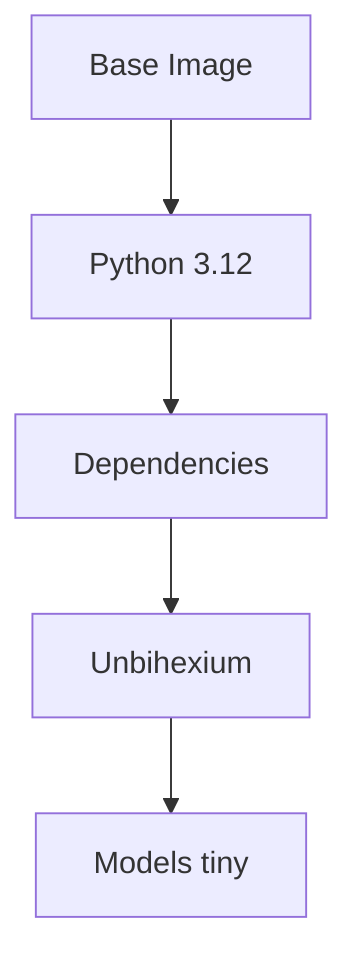

# Docker Operations

## Purpose

Container deployment and operations guide.

## Container Architecture



## Image Size Analysis

$$
\text{Size} = \text{Base} + \text{Deps} + \text{Code} + \text{Models}
$$

| Image | Size | Models |
| ------- | ------ | -------- |
| unbihexium:slim | 500 MB | None |
| unbihexium:tiny | 600 MB | Tiny only |
| unbihexium:full | 1.2 GB | All |

## Quick Start

```bash
# Pull image
docker pull ghcr.io/unbihexium-oss/unbihexium:latest

# Run inference
docker run -v $(pwd)/data:/data unbihexium \
  infer ship_detector_tiny -i /data/input.tif -o /data/output.tif
```

## Docker Compose

```yaml
version: "3.8"
services:
  unbihexium:
    image: ghcr.io/unbihexium-oss/unbihexium:latest
    volumes:
      - ./data:/data
      - ./cache:/root/.unbihexium
```

## Build Custom Image

```dockerfile
FROM ghcr.io/unbihexium-oss/unbihexium:latest
COPY custom_models/ /models/
ENV UNBIHEXIUM_MODEL_DIR=/models
```
