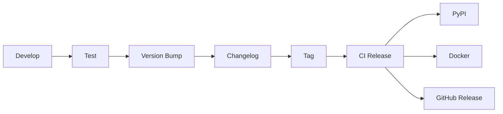

# Release Process

## Purpose

Procedures for releasing new versions.

## Release Workflow



## Semantic Versioning

$$
\text{Version} = \text{MAJOR}.\text{MINOR}.\text{PATCH}
$$

| Change Type | Version Bump |
| ------------- | -------------- |
| Breaking API | MAJOR |
| New feature | MINOR |
| Bug fix | PATCH |

## Release Checklist

1. Update version in `pyproject.toml`
2. Update `CHANGELOG.md`
3. Create release PR
4. Merge to main
5. Create git tag
6. CI handles the rest

## Commands

```bash
# Bump version
poetry version minor

# Create tag
git tag -a v1.1.0 -m "Release v1.1.0"

# Push tag
git push origin v1.1.0
```

## CI Release Jobs

| Job | Artifact |
| ----- | ---------- |
| build | wheel, sdist |
| publish-pypi | PyPI upload |
| publish-docker | Container push |
| github-release | Assets upload |
