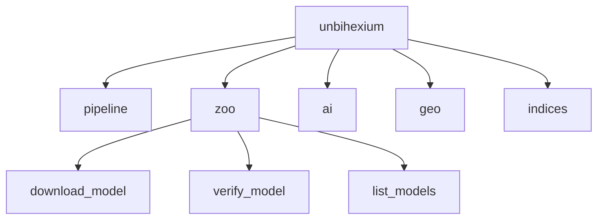

# API Reference

## Purpose

Python API reference for Unbihexium.

## Module Structure



## API Coverage

$$
\text{Coverage} = \frac{\text{Documented Functions}}{\text{Public Functions}} = 100\%
$$

| Module | Classes | Functions |
|--------|---------|-----------|
| `unbihexium.pipeline` | 3 | 8 |
| `unbihexium.zoo` | 2 | 12 |
| `unbihexium.ai` | 5 | 15 |
| `unbihexium.geo` | 4 | 10 |

## Core Classes

### Pipeline

```python
from unbihexium import Pipeline

# Create from config
pipeline = Pipeline.from_config("detection")

# Run
result = pipeline.run("input.tif")
result.save("output.tif")
```

### Model Zoo

```python
from unbihexium.zoo import download_model, list_models, verify_model

# List available models
models = list_models()

# Download
path = download_model("ship_detector_base")

# Verify integrity
is_valid = verify_model("ship_detector_base")
```

### Inference

```python
from unbihexium.ai import Inference

# Load model
inference = Inference.from_model("ship_detector_base")

# Run on data
predictions = inference.predict(input_array)
```

## Configuration

```python
from unbihexium import Config

config = Config(
    device="cuda",
    batch_size=4,
    tile_size=256
)
```
