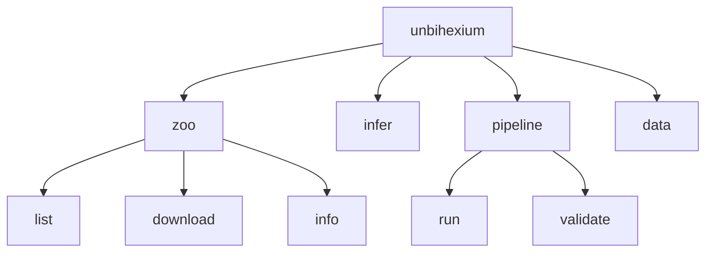

# CLI Reference

## Purpose

Complete reference for the Unbihexium command-line interface.

## Command Structure



## Command Reference

$$
\text{Command} = \text{Group} + \text{Subcommand} + \text{Arguments} + \text{Options}
$$

| Command | Description | Example |
|---------|-------------|---------|
| `unbihexium --version` | Show version | `unbihexium --version` |
| `unbihexium zoo list` | List models | `unbihexium zoo list` |
| `unbihexium zoo download` | Download model | `unbihexium zoo download ship_detector_base` |
| `unbihexium infer` | Run inference | `unbihexium infer model_id -i in.tif -o out.tif` |
| `unbihexium pipeline run` | Run pipeline | `unbihexium pipeline run detection -c config.yaml` |

## Global Options

| Option | Description |
|--------|-------------|
| `--version` | Show version |
| `--help` | Show help |
| `--verbose` | Verbose output |
| `--quiet` | Suppress output |

## Zoo Commands

```bash
# List all models
unbihexium zoo list

# Filter by task
unbihexium zoo list --task detection

# Download model
unbihexium zoo download ship_detector_base

# Model info
unbihexium zoo info ship_detector_base
```

## Inference Commands

```bash
# Basic inference
unbihexium infer ship_detector_base -i input.tif -o output.tif

# With options
unbihexium infer ship_detector_base \
  -i input.tif \
  -o output.tif \
  --device cuda \
  --batch-size 4
```
