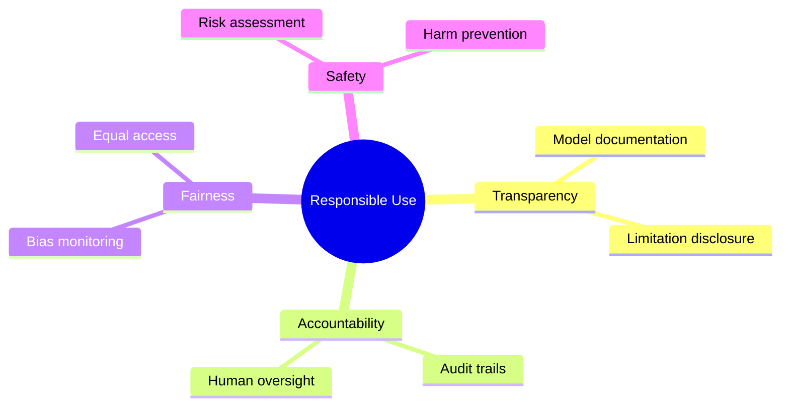

# Responsible Use Policy

## Purpose

Guidelines for responsible use of Unbihexium capabilities.

## Ethical Framework

## Use Case Classification

$$
\text{Approval Level} = f(\text{Sensitivity}, \text{Impact}, \text{Reversibility})
$$

| Use Case | Classification | Guidance |
| ---------- | --------------- | ---------- |
| Environmental monitoring | Low risk | General use |
| Agricultural analytics | Low risk | General use |
| Urban planning | Medium risk | Review recommended |
| Insurance underwriting | Medium risk | Human oversight |
| Security/defense | High risk | Restricted, neutral only |
| Humanitarian | Approved | Priority support |

## Prohibited Uses

This library MUST NOT be used for:

- Weapons development or targeting
- Mass surveillance without legal basis
- Discrimination or profiling
- Environmental damage facilitation

## Defense/Intelligence Guidance

Capabilities marked as "neutral analytics" are provided for:

- Research and academic study
- Humanitarian applications
- Historical analysis
- Situational awareness

They do NOT provide:

- Targeting guidance
- Weapons integration
- Real-time tactical support

## Human Oversight

All high-impact decisions must include human review.
