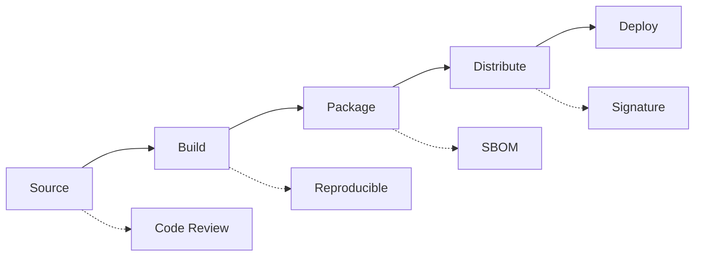

# Supply Chain Security

## Purpose

Security measures for the software supply chain.

## Supply Chain Model



## Trust Formula

$$
\text{Trust} = \prod_{i=1}^{n} \text{Verification}_i
$$

| Stage | Control | Implementation |
|-------|---------|---------------|
| Source | Code review | Required approvals |
| Dependencies | Pinning | requirements.txt with hashes |
| Build | Reproducible | GitHub Actions |
| Package | SBOM | CycloneDX generation |
| Distribution | Signing | Sigstore (planned) |

## Dependency Controls

1. All deps pinned with exact versions
2. Hash verification enabled
3. Dependabot monitoring
4. Safety scanning in CI

## SBOM Generation

```bash
pip install cyclonedx-bom
cyclonedx-py --pip -o sbom.json
```

## Verification

```bash
pip install --require-hashes -r requirements.txt
```
