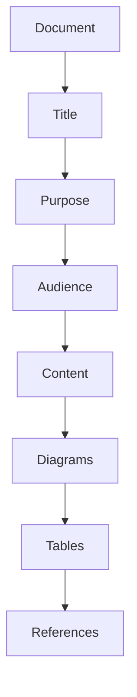

# Style Guide

## Purpose

Writing standards for Unbihexium documentation.

## Document Structure



## Readability Target

$$
\text{Flesch-Kincaid} \leq 12, \quad \text{Sentence Length} \leq 25 \text{ words}
$$

## Required Elements

| Element | Major Docs | Minor Docs |
|---------|------------|------------|
| Mermaid diagram | Required | Optional |
| LaTeX formula | Required | Optional |
| Table | Required | Optional |
| Code examples | Recommended | Optional |

## Writing Rules

1. **No emojis** in any documentation
2. **Active voice** preferred
3. **Present tense** for instructions
4. **Technical accuracy** over brevity
5. **Professional tone** throughout

## Headers

Use hierarchical headers:
- H1: Document title (one per file)
- H2: Major sections
- H3: Subsections
- H4: Details (sparingly)

## Code Blocks

Always specify language:
````markdown
```python
from unbihexium import Pipeline
```
````

## Tables

Align columns and use headers:
```markdown
| Column 1 | Column 2 |
|----------|----------|
| Value 1  | Value 2  |
```

## Mermaid Diagrams

Use for:
- Architecture diagrams
- Workflows
- Hierarchies
- Data flows

## LaTeX Formulas

Use for:
- Mathematical expressions
- Metrics definitions
- Algorithm descriptions

## Links

- Use relative paths within docs
- Verify all links work
- No broken references
