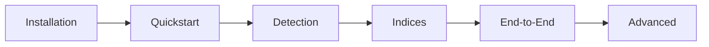

# Tutorials Index

## Purpose

Step-by-step tutorials for common workflows.

## Learning Path

## Time Investment

$$
T_{\text{total}} \approx \sum_{t \in \text{Tutorials}} T_t \approx 4 \text{ hours}
$$

| Tutorial | Duration | Difficulty |
| ---------- | ---------- | ------------ |
| [Detection](detection.md) | 30 min | Beginner |
| [Indices](indices.md) | 20 min | Beginner |
| [Geostatistics](geostat.md) | 45 min | Intermediate |
| [End-to-End](end_to_end.md) | 60 min | Intermediate |
| [Notebooks](notebooks.md) | 30 min | Beginner |

## Prerequisites

- Python 3.10+ installed
- Unbihexium installed
- Sample data downloaded

## Tutorial Format

Each tutorial includes:

1. Objective statement
2. Step-by-step instructions
3. Code examples
4. Expected outputs
5. Troubleshooting tips
