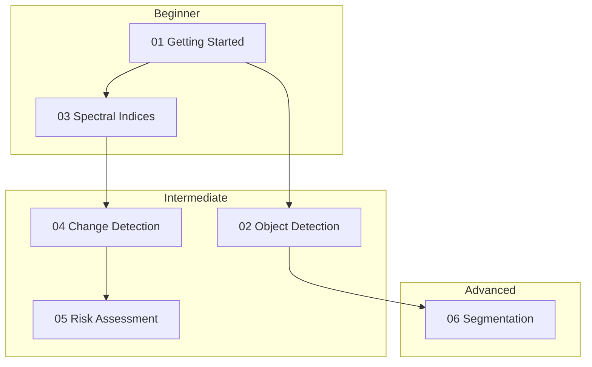

# Notebooks Tutorial

## Purpose

Guide to using the Unbihexium Jupyter notebooks for learning and exploration.

## Prerequisites

- Python 3.10+
- Jupyter Notebook or JupyterLab
- unbihexium installed

## Notebook Architecture



## Time Investment

$$T_{total} = \sum_{i=1}^{6} T_i \approx 2 \text{ hours}$$

| Notebook | Duration | Difficulty |
|----------|----------|------------|
| 01_getting_started | 15 min | Beginner |
| 02_object_detection | 20 min | Intermediate |
| 03_spectral_indices | 15 min | Beginner |
| 04_change_detection | 20 min | Intermediate |
| 05_risk_assessment | 25 min | Intermediate |
| 06_segmentation | 20 min | Advanced |

## Installation

```bash
# Install dependencies
pip install unbihexium jupyter

# Navigate to notebooks
cd examples/notebooks

# Start Jupyter
jupyter notebook
```

## Notebook Contents

Each notebook includes:
1. Badges and version info
2. Purpose and prerequisites
3. Mathematical foundations
4. Code examples
5. Exercises
6. Next steps

## Running in Colab

[](https://colab.research.google.com/github/unbihexium-oss/unbihexium)

Upload notebooks to Google Colab for cloud execution.

## Related Documentation

- [API Reference](../reference/api.md)
- [CLI Reference](../reference/cli.md)
- [Model Zoo](../model_zoo/model_catalog.md)

---

**Copyright 2025 Unbihexium OSS Foundation. Apache-2.0 License.**
