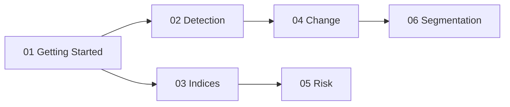

# Notebooks

[](https://github.com/unbihexium-oss/unbihexium/actions)
[](https://pypi.org/project/unbihexium/)
[](../../LICENSE.txt)

## Purpose

Interactive Jupyter notebooks demonstrating Unbihexium capabilities.

## Notebook Index



## Prerequisites

$$\text{Setup Time} \approx 15 \text{ minutes}$$

| Requirement | Version |
|-------------|---------|
| Python | 3.10+ |
| unbihexium | 1.0.0+ |
| onnxruntime | 1.15+ |
| numpy | 1.24+ |

## Available Notebooks

| Notebook | Topic | Duration |
|----------|-------|----------|
| [01_getting_started.ipynb](01_getting_started.ipynb) | Installation and basics | 15 min |
| [02_object_detection.ipynb](02_object_detection.ipynb) | Ship, building, vehicle detection | 20 min |
| [03_spectral_indices.ipynb](03_spectral_indices.ipynb) | NDVI, NDWI, SAVI calculation | 15 min |
| [04_change_detection.ipynb](04_change_detection.ipynb) | Bi-temporal change analysis | 20 min |
| [05_risk_assessment.ipynb](05_risk_assessment.ipynb) | Flood, wildfire, hazard risk | 25 min |
| [06_segmentation.ipynb](06_segmentation.ipynb) | LULC, crop classification | 20 min |

## Running Notebooks

```bash
# Install Jupyter
pip install jupyter

# Start notebook server
jupyter notebook examples/notebooks/

# Or use JupyterLab
pip install jupyterlab
jupyter lab examples/notebooks/
```

## Learning Path

1. Start with **01_getting_started** to verify installation
2. Choose a domain notebooks based on your use case
3. Each notebook includes formulas, examples, and exercises

---

**Copyright 2025 Unbihexium OSS Foundation. Apache-2.0 License.**
